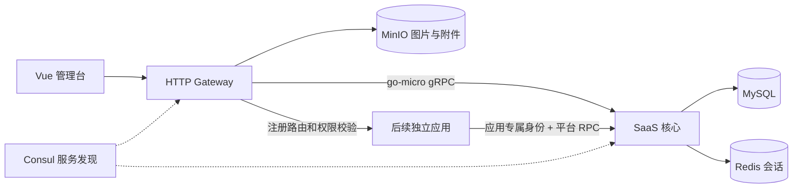

# Kerthus

基于 **go-micro v6** 的 Kerthus 多租户应用平台基础底座。当前已实现可运行的首期闭环，支持账号、租户、组织、应用、资源和权限管理，并为后续独立应用接入预留扩展边界。



## 当前工作区数据

已从本机 `3306/beehive_saas` 导入 `3306/kerthus_saas` 并切换运行配置：62 个账号、45 个租户、3567 条地区数据及原组织/角色关系。原库保持不变。当前启动用 `make dev`，使用原系统手机号和密码登录；不要重复初始化默认种子。详细范围、备份及转换见 [数据迁入说明](docs/migration/legacy-data-import.md)。

## 全新空库的本地初始化

需要 Go 1.26、Node 20+、Yarn 1 和 Docker Compose。开发环境已在 Go 1.26.6、Node 25.4.0、Yarn 1.22.22 上验证。

```sh
make infra
make deps
make migrate
make seed
make dev
```

- 管理台：<http://127.0.0.1:15173>
- HTTP API：<http://127.0.0.1:18080>；健康检查 `/healthz`
- RPC：`127.0.0.1:19090`，服务名 `kerthus.saas`
- MySQL `13306`、Redis `16379`、Consul `18500`、MinIO `19000/19001`，均绑定本地回环地址。

`make infra` 自动生成 `.local/saas.env`，权限为 0600。管理员手机号由 `KERTHUS_ADMIN_PHONE` 指定；随机密码见同文件 `KERTHUS_ADMIN_PASSWORD`。重复 seed 不重置密码、不提升已有普通账号，也不恢复被停用的管理员。

`make dev` 同时运行核心、网关和前端，Ctrl-C 结束这三个子进程。也可以分别运行 `make saas`、`make gateway`、`make web`。启动前停止占用相同端口的开发进程。`make stop-infra` 停止依赖，保留数据卷。

## 当前功能

- 全局账号、密码登录、Redis 会话、密码修改和版本撤销；原密码完整兼容，超过 72 字节的旧密码登录后升级为 Argon2id。
- 租户创建与事务性审核开户；成员与全局账号分离；组织、岗位、角色管理。
- 应用目录、租户开通范围及期限、资源/API 绑定、角色授权交集、动态菜单。
- 最后管理员保护、跨租户归属校验、操作审计。
- 头像/LOGO 图片上传：PNG/JPEG/WebP，最大 10 MiB，服务端检查内容类型，MinIO 私有桶，网关提供公开图片链接。
- 私有通用附件：默认 50 MiB，带租户/应用鉴权下载、中文文件名和失败清理；详见 [附件接口](docs/migration/attachments.md)。
- 第三方应用目录与租户开通、内嵌页面和外链导航；公开属性不绕过租户授权，链接不会附加平台凭据。
- 版本化应用清单校验/注册，独立应用 HTTP 路由、服务身份绑定和 `appkit` 权限客户端。

旧 HTTP 适配保留 `{code,data,msg,mesc}` 与 `access-token/tenant-id/app-id/unit-id/section-id` 请求头。新审核接口用 POST `/system/tenant/approve`，新账号开户需显式提供 `admin_password`；停用成员使用 `/system/employee/setStatus`，全局账号停用仅限平台管理员。

## 代码结构

```text
cmd/                       gateway、saas、saasctl 三个启动入口
api/proto/saas/v1/          平台 typed RPC 契约
gen/go/saas/v1/             生成的 protobuf/go-micro 代码
api/http/                  旧管理台 HTTP 操作目录
applications/              system、basic 内置应用及后续应用定义
internal/saas/domain/       身份、租户、组织、目录、权限、审计、文件、字典
internal/saas/usecase/      框架无关的事务用例及 DTO
internal/saas/ports/        数据库、会话与对象端口
internal/saas/adapters/     MySQL、Redis、RPC
internal/gateway/          旧协议映射、上传、应用 HTTP 代理
internal/platform/         配置、go-micro 装配、清单校验、存储
internal/appkit/            应用调用平台鉴权的薄客户端
migrations/mysql/          带校验和的数据库版本迁移
web/admin/                 复用后的 Vue 管理台
scripts/                   初始化、开发、测试与依赖边界检查
docs/                      原项目调研、设计、迁移及验证记录
```

首期一个 Go module、一个 SaaS 核心进程，以本地数据库事务保证开户/授权一致性。领域不依赖 go-micro 或 GORM。仓储端口目前采用封闭表名和字段白名单的统一事务接口；以后按复杂度拆更细的仓储，不提前拆数据库或分布式事务。

## 检查

```sh
make test                   # Go 单测、vet、应用依赖边界
make integration            # 独立随机 MySQL 测试库，race；需要本地 Docker MySQL
make check                  # 再运行 Vue 类型检查及生产构建
make smoke                  # 运行中的真实 HTTP/RPC/DB/Redis 闭环
make smoke-upload           # 本地上传/对象存储往返，保留一个测试像素
make smoke-crud              # 临时数据库中的真实表单CRUD；需先启动前端
make smoke-grants            # 临时数据库中的角色范围、应用有效期浏览器回归
make smoke-approval          # 审核密码输入、校验和弹窗关闭
make smoke-dialogs           # 确认弹窗、应用切换和成员密码重置
make smoke-session           # 并发401、重新登录与平台身份前端回归
make tools generate         # 修改 proto 后重新生成；另需 protoc
```

数据库测试会创建并清理 `kerthus_test_*` 数据库；普通 `go test` 没有测试 DSN 时跳过数据库测试。可通过 `KERTHUS_TEST_MYSQL_DSN` 指定专用测试服务器。可选浏览器脚本 `scripts/smoke-browser.cjs` 需要 Playwright 和 Chrome，`KERTHUS_PLAYWRIGHT_PATH` 可指定 Playwright 模块位置。

前端开发服务启动后，运行 `node scripts/smoke-session.cjs` 可验证并发会话过期、密码错误、旧请求迟到以及重复退出。该脚本使用隔离的接口响应，不需要数据库或真实账号；同样支持 `KERTHUS_PLAYWRIGHT_PATH`。

`test-browser-crud.py` 自动创建随机 `kerthus_test_browser_*` 数据库、独立 go-micro 注册表及 Redis 会话命名空间，浏览器请求只转发到这套测试服务，结束后删除测试库并撤销测试会话。它不使用原账号密码，不向当前业务库写入。默认测试数据库实例为本地 Docker MySQL，可通过 `KERTHUS_TEST_MYSQL_DSN` 指定专用实例。传入 `scripts/smoke-approval.cjs` 或 `scripts/smoke-dialogs.cjs` 可分别验证开户审核、弹窗和密码重置流程。

## 数据与后续应用

当前工作区已导入本地旧库及地区字典；其他全新环境的地区字典默认空，可用经过确认的完整 CSV 导入：

```sh
KERTHUS_ENV_FILE=.local/saas.env go run ./cmd/saasctl import-districts /path/to/districts.csv
```

CSV 头为 `id,parent_id,name`，根节点 parent_id 为 0，所有父节点必须在文件内。导入校验重复、缺失父级和环，事务性更新，不删除旧 ID。

新增应用接入步骤见 [应用接入说明](docs/architecture/application-onboarding.md)，运行配置见 [部署说明](deploy/README.md)。最新结果见 [SaaS 基础底座验收](docs/migration/foundation-acceptance.md)；首期实现记录见 [验证记录](docs/migration/implementation-validation.md) 和 [集成验收](docs/migration/runtime-validation.md)。
