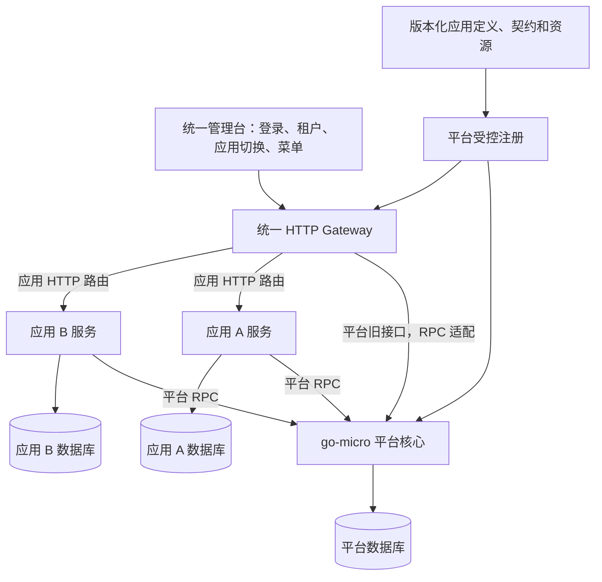

# SaaS 后续应用扩展设计

日期：2026-09-11。用户要求在基础底座设计中考虑后续增加其他 SaaS 应用。本文扩充 [项目结构设计](/Users/alex/golang/src/kerthus/docs/architecture/project-structure.md)，明确平台与应用之间长期保留的边界；当前只实施底座范围，注册工具与通用接入边界已经落地，具体应用后续增加。

## 1. 平台与应用分工



**平台负责**全局身份、会话、租户、成员、组织、应用目录、开通权益、权限、导航及必要的文件/审计能力。**应用负责**自己的业务模型、数据、流程、API 和业务页面。

一个应用是租户可开通的产品单元，通过稳定 `app_code` 识别；一个应用可以有一个或多个后端服务，也可以只有页面入口。应用 ID 不等同于服务发现名称、进程名或数据库名。注册、部署、租户开通、用户角色授权是不同状态。

目标是：新增应用主要增加应用自己的代码、契约、资源与部署配置，平台通过既定注册和授权流程接入，不为每个应用在核心服务增加业务分支。

## 2. 目录扩展

延续首期单 module，按以下路径增加应用。`<app-code>` 代表未来真实应用的稳定标识，不创建字面占位目录。

```text
kerthus/
├── cmd/
│   ├── gateway/                       # 平台 HTTP 适配与统一路由
│   ├── saas/                          # 平台核心
│   ├── saasctl/                       # 平台运维命令
│   └── <app-code>/                    # 后续应用独立启动入口
├── applications/
│   └── <app-code>/app.yaml             # 应用注册定义与资源引用
├── api/
│   ├── http/admin.openapi.yaml        # 旧平台契约
│   ├── http/apps/<app-code>/v1.yaml    # 应用 HTTP 契约
│   ├── proto/saas/v1/                 # 平台 RPC 契约
│   └── proto/apps/<app-code>/v1/       # 有内部调用需要时定义应用 RPC
├── gen/go/                            # 按平台和应用分区生成
├── internal/
│   ├── saas/                          # 只包含通用底座
│   ├── gateway/routing/               # 已注册应用的路由装配
│   ├── apps/<app-code>/
│   │   ├── bootstrap/
│   │   ├── transport/http/            # 应用 HTTP 参数与 DTO
│   │   ├── transport/rpc/             # 按需提供内部 RPC
│   │   ├── usecase/
│   │   ├── domain/
│   │   └── adapters/
│   ├── appkit/
│   │   ├── client/                    # 平台 RPC 客户端薄封装
│   │   ├── authorization/             # 身份解析/权限检查的调用适配
│   │   └── audit/                     # 向平台提交结构化审计
│   └── platform/                      # 通用技术组件
├── migrations/apps/<app-code>/        # 应用自己维护数据库版本
├── seeds/apps/<app-code>/             # 版本化菜单、操作资源、角色模板
├── deploy/apps/<app-code>/            # 应用部署、凭据引用和服务发现配置
├── tests/apps/<app-code>/             # 应用契约与平台接入验收
└── web/admin/src/
    ├── applications/                  # 构建期应用入口/组件注册
    ├── views/                         # 已复用页面保持原路径
    └── views/apps/<app-code>/          # 新应用页面的推荐位置
```

`appkit` 只封装平台契约调用，不复制角色/权益规则，不包含业务仓储；它依赖生成的 RPC 消息，不依赖平台内部模型。同仓库内保持一个 module；应用需要独立仓库或版本节奏时，把平台契约与客户端发布为版本化模块，再拆应用代码。Go 的根 `internal` 不能强制同仓库兄弟包互相隔离，因此应通过 import 检查约束 apps→saas、saas→apps 和应用之间的实现包依赖。

## 3. 应用注册契约

应用定义是版本化数据，通过受控部署/管理命令导入平台；它不执行安装脚本，也不意味着 Go 二进制可运行时加载业务代码。首期需要的字段建议如下，具体序列化 schema 在实现时冻结：

| 项目 | 用途与约束 |
| --- | --- |
| schema_version | 注册定义的格式版本，与应用发布版本分开 |
| app_code、name | 稳定标识与显示名；改显示名不改变权限命名空间 |
| release_version、platform_api_version | 应用发布版本与依赖的平台契约版本 |
| http_contract、rpc_contract | 引用应用自己的版本化契约；RPC 契约按需提供 |
| service_key、route_prefix | 绑定受控服务发现配置；新应用默认 `/api/apps/<app-code>/v1/...` |
| frontend_entry、home、component_registry | 定义构建内页面入口；后续独立前端使用明确类型的入口 |
| resources、resource_version | 引用菜单、按钮、可授权操作与范围能力；ID/code 稳定 |
| role_templates | 应用角色模板；开通时明确实例化策略，不覆盖租户自定义角色 |
| capabilities | 应用确实使用的文件、组织范围等平台能力 |
| provisioning | 是否需要租户级数据初始化；首期默认不要求异步初始化 |

全局 `app_code` 唯一；资源和 operation 的身份以 `(app_code, resource_code)`、`(app_code, operation_id)` 约束。旧已部署权限码可以保留兼容映射，新资源建议使用应用命名空间。应用注册只能更新自己拥有的资源，不得写入平台管理资源。

应用 HTTP 契约是操作定义源，注册导入校验资源引用、前缀冲突、唯一标识、组件入口、平台 API 版本兼容。运行环境提供受信 service_key→服务地址映射；不接受租户上传任意 upstream URL。首期注册流程可由 `saasctl` 命令执行，后续有真实需要再建设应用发布管理 UI。

## 4. 路由与 go-micro 调用边界

- 现有平台请求继续由 Gateway 的旧协议适配器转换为平台 RPC，保留 `/system/*` 等契约。
- 新应用由自己的 HTTP transport 提供 API，Gateway 按注册前缀和服务发现转发。应用用 go-micro 调用平台能力；需要提供内部能力时再暴露自己的 RPC handler。这样增加应用 HTTP 操作时不需要逐项在中央 Gateway 编写业务 mapper。
- Gateway 校验入口格式、路由、请求大小和基础访问条件，应用端仍通过平台契约验证用户/租户/权益及 action，再执行本地资源归属检查。调用应用内部地址或 RPC 不能绕过授权。
- 统一入口不代表“平台核心转发所有业务”。Gateway 直接路由到应用，应用只在需要身份、授权和通用能力时调用平台。
- `/app/info/servers/routes` 的兼容目录可聚合已受控注册的应用 HTTP 操作。它展示可授权操作；运行时服务发现处理实例地址，两者职责保持分开。
- 服务未部署或暂时不可用返回服务可用性错误，不把租户开通记录删除或伪装成用户无权限。

## 5. 开通、授权与停用

正常访问一个应用需要同时成立：全局应用启用、租户有效、成员有效、租户应用开通有效、用户获得相应操作权限；应用还检查自身数据是否属于该租户。应用不能信任浏览器传来的 app-id 来选择自己的权益范围，必须与服务自身绑定的 app_code 匹配。

平台保留这些独立状态：

1. **注册**：平台知道应用及版本、资源和入口；不意味着已给任意租户开通。
2. **部署就绪**：服务实例和前端入口可用；不自动授予业务权限。
3. **租户开通**：租户得到资源上限、有效期及启用状态；角色只能在上限内授权。
4. **角色授权**：用户得到实际可执行操作；只看到导航父节点不增加 API 权限。
5. **暂停/撤销**：应用访问立即被拒绝，数据保留按明确策略处理；撤销开通不直接删除业务数据。

无需应用数据初始化时，平台内的开通操作可在本地事务中完成。有初始化要求时，扩展为 `provisioning → active / failed`：平台提交开通意图和 outbox，应用按 `(tenant_id, app_code, provisioning_version)` 幂等初始化并回执，平台检查回执版本及当前状态后激活。取消/停用后到达的旧回执不得重新激活。应用数据库与平台数据库不能共用本地事务；可靠事件与任务执行器在出现这类真实需求时加入。

升级应用只更新应用定义拥有的资源与契约；保留租户自定义角色。新增操作不默认授予现有角色，默认管理员模板如何覆盖新资源要有显式策略。删除或改名先做兼容/废弃处理，迁移完成后再清理旧映射。

## 6. 数据、身份与事件

- 平台只写平台表；应用只写自己的表。可以使用同一个 MySQL 实例，但按应用划分逻辑数据库/schema 与访问权限。平台和应用之间不做跨库 join、共享事务或数据库外键，用 ID 与公开契约关联。
- 应用租户数据表与关联带 tenant_id；应用私有配置属于应用，平台只保存目录、权益、入口等公共配置。缓存、对象 key、审计和后台任务都包含租户/应用维度。
- 应用通过平台拿到已验证的 actor、租户成员、有效 app、策略版本和数据范围；身份必须绑定目标应用和服务调用方。独立服务初期优先在线验证；后续使用签名上下文或缓存时，必须同时设计有效期、目标绑定和撤权版本，不将裸 metadata 当身份证明。
- 全局停用、租户停用、成员移除、应用撤销应阻断对应作用域的新操作。事件只用于加速同步；事件丢失不能使旧权限无限继续。高敏感写操作的在途撤权策略需按平台规则执行。
- 应用可以缓存必要的用户/组织展示数据，但不得把缓存副本当成授权事实；缓存带版本，并说明刷新与删除处理。
- 未来跨应用协作通过版本化 RPC 或事件契约。事件包含 event_id、schema_version、tenant_id、app_code、发生时间与相关 ID，消费者去重，不依赖恰好一次投递，也不传播密码/token。
- 平台不内置应用数据删除脚本。需要销户清理时，由平台发出受控请求，各应用按自身保留与删除规则执行并报告结果。

## 7. 前端扩展方式

首期继续复用一个 Vue 管理台：公共壳管理登录、租户选择、应用切换、导航、会话和平台管理页面。旧页面保留原 component 路径，新应用页面推荐放在 `views/apps/<app-code>`；构建期注册组件，平台下发该应用的已授权菜单。

**这一方式新增页面需要重建前端。** 数据库注册菜单只让已打包组件可见，不会下载任意 Vue 源码。新增纯菜单/授权数据与新增页面代码的发布步骤不同。

后续应用需要独立发布前端时，增加独立站点入口与明确的认证接入协议，再评估独立前端集成方式。跨域应用使用一次性短期登录交接或约定的身份协议，不把平台长期 token 放在跳转 URL 中；应用不能因共享登录而获得其他应用权限。当前不实现运行时插件加载或微前端框架。

## 8. 当前底座需要提前落实的点

现在设计并落地：稳定应用标识、目录/资源所有权、HTTP 操作目录、租户开通模型、角色授权交集、版本化注册校验、应用前缀路由、客户端契约边界，以及前端构建期组件入口约定。

第一款新应用接入时增加：应用自己的服务/数据库/迁移、前端页面、部署配置，以及接入验收。按实际需要再增加：异步初始化、跨应用事件、独立前端发布、独立 Go modules。无需提前创建占位业务代码或商业套餐系统。

应用接入的验收至少覆盖：

- 新应用注册后可出现在应用目录，未开通租户无法进入；开通后仍受成员角色限制。
- A 应用不能访问 B 的资源或写 B 的权限定义；A/B 同名局部资源不会碰撞。
- 从入口与应用直连分别验证跨租户、伪造 app-id 和伪造服务上下文均被拒绝。
- 应用停用、角色撤权、开通到期后旧会话访问被拒绝，其他应用保持正常。
- 应用服务下线不影响平台登录与管理，也不改变开通状态。
- 资源升级保留租户自定义授权，新操作不意外扩权；旧前端构建缺少组件时注册/发布校验明确失败。
- 需要初始化时验证重复、失败重试、取消后的延迟回执；应用停用不直接丢失数据。

本轮已实施 schema v1、saasctl 注册、应用代理、appkit 与隔离测试，实际格式和步骤以 [应用接入说明](application-onboarding.md) 为准；本文中异步初始化、事件与独立前端仍为后续设计。
