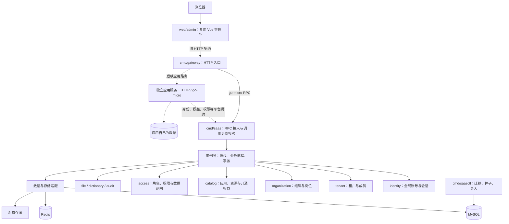
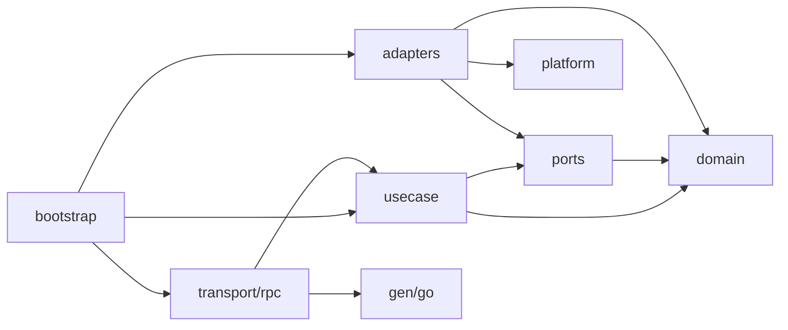
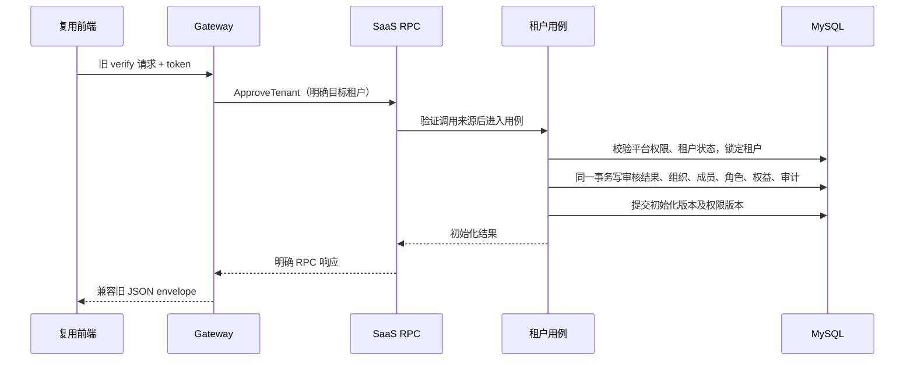

> 2026-09-11 实施更新：首期已经落地。实际目录、启动方式和验证见 [根 README](../../README.md)，本文保留设计阶段的模块边界与后续演进说明。

# Kerthus SaaS 项目结构设计

日期：2026-09-11。依据：[SaaS 基础底座迁移要点](/Users/alex/golang/src/kerthus/docs/migration/saas-foundation-plan.md)。本文件描述建议的目标结构；当前仅写入设计文档，目录树中的服务、配置、契约和前端尚未创建。

## 1. 总体结构

采用“平台核心 + 可接入应用”的结构，首期单仓库、单 Go module。基础底座先运行 HTTP Gateway、go-micro SaaS 核心服务两个常驻进程，另提供一次性运维命令；后续应用增加独立服务入口，平台核心维持独立边界。前端作为独立 Node 项目放在 `web/admin`。应用扩展的注册契约、目录和生命周期见 [应用扩展设计](/Users/alex/golang/src/kerthus/docs/architecture/application-extension.md)。



图中核心服务下的领域节点都是同进程内的 Go 包。MySQL 保存业务事实；Redis 用于会话和经过版本校验的缓存；对象存储承载文件内容。具体 go-micro 发布版、RPC transport、发现方式和存储供应商在实现阶段锁定。

文件上传另有数据通路：Gateway 接收 multipart，经核心授权后流式写入受控对象存储，再调用核心确认文件元数据。图中普通业务走 RPC；大文件内容不默认放进普通 unary RPC 消息。

## 2. 仓库目录

```text
kerthus/
├── go.mod                              # 后端单 Go module
├── go.sum
├── Makefile                            # generate / build / test / dev 等入口
├── README.md                           # 本地启动、开发流程、文档索引
├── .gitignore                          # 忽略 .local、构建输出和本机配置
│
├── cmd/
│   ├── gateway/main.go                 # HTTP 进程，装配后启动
│   ├── saas/main.go                    # go-micro 核心进程
│   └── saasctl/main.go                 # migrate / seed / import 等子命令
│   # 后续增加 <app-code>/main.go，各应用独立启动
│
├── api/
│   ├── http/
│   │   └── admin.openapi.yaml          # 旧平台 HTTP 契约、操作 ID 与分组
│   └── proto/saas/v1/
│       ├── identity.proto             # 账号、登录、会话
│       ├── tenant.proto               # 租户、成员、开户
│       ├── organization.proto         # 组织与岗位
│       ├── catalog.proto              # 应用、资源、租户权益
│       ├── access.proto               # 角色、授权、导航和范围
│       └── support.proto              # 文件授权/确认、字典等必要能力
│   # 后续 HTTP / RPC 契约按 apps/<app-code>/v1 分区
│
├── applications/                       # 应用注册定义，不放业务实现
│   └── <app-code>/app.yaml             # 后续：标识、版本、契约/资源/入口引用
│
├── gen/
│   └── go/saas/v1/                     # 根据 proto 生成的消息与 RPC 代码
│
├── internal/
│   ├── gateway/
│   │   ├── bootstrap/                 # HTTP 路由、RPC client 与依赖装配
│   │   ├── handler/                   # 对应平台端点的 HTTP handler
│   │   ├── dto/                       # 旧 JSON 字段、分页、上传格式
│   │   ├── mapper/                    # HTTP DTO ↔ RPC 消息
│   │   ├── middleware/                # 请求 ID、大小限制、CORS 等 HTTP 规则
│   │   ├── catalog/                   # servers/routes 兼容操作目录
│   │   ├── routing/                   # 应用前缀 → 已注册服务的受控路由
│   │   └── upload/                    # multipart 流式传输与上传确认流程
│   │
│   ├── saas/
│   │   ├── bootstrap/                 # 核心依赖装配与服务注册
│   │   ├── transport/rpc/             # go-micro handler、RPC 输入转换
│   │   ├── usecase/                   # 命令/查询、上下文解析、授权、事务
│   │   │   ├── identity/              # 登录、改密、注销等
│   │   │   ├── tenant/                # 租户审核初始化、成员管理
│   │   │   ├── organization/          # 组织岗位维护
│   │   │   ├── catalog/               # 应用开通、撤销与资源维护
│   │   │   ├── access/                # 角色授权、导航和权限查询
│   │   │   ├── support/               # 字典、文件元数据与审计查询
│   │   │   └── authorization/         # 统一身份/租户/应用授权判定
│   │   ├── domain/
│   │   │   ├── identity/              # User、Session 与仓储接口
│   │   │   ├── tenant/                # Tenant、Membership、生命周期
│   │   │   ├── organization/          # Org、Position、成员关联
│   │   │   ├── catalog/               # App、Resource、API、Entitlement
│   │   │   ├── access/                # Role、Grant、DataScope、策略规则
│   │   │   ├── file/                  # 文件归属与元数据
│   │   │   ├── dictionary/            # 平台字典
│   │   │   └── audit/                 # actor、target、action、结果
│   │   ├── ports/                     # UnitOfWork、Clock、存储等外部接口
│   │   └── adapters/
│   │       ├── mysql/                 # 仓储实现、事务和权限版本
│   │       ├── redis/                 # 会话/缓存适配
│   │       └── objectstore/           # 文件元数据确认与存储校验适配
│   │
│   ├── apps/                          # 后续应用实现，不能导入 saas 内部包
│   │   └── <app-code>/                # bootstrap、transport、usecase、domain、adapters
│   ├── appkit/                        # 应用使用的平台客户端与上下文适配
│   │
│   ├── platform/
│   │   ├── config/                    # 配置加载与校验
│   │   ├── logging/                   # 结构化日志与字段脱敏
│   │   ├── observability/             # 健康检查、指标、追踪
│   │   ├── micro/                     # go-micro 通信/服务身份通用装配
│   │   └── objectstore/               # 低层对象存储客户端
│   │
│   └── migration/
│       └── legacy/                    # 旧 System 数据转换、校验、ID 映射
│
├── migrations/
│   ├── mysql/                         # 平台核心有顺序的 schema 迁移文件
│   └── apps/<app-code>/               # 后续应用各自的 schema 迁移
├── seeds/
│   ├── platform/                      # 基础应用、资源/API、角色模板
│   └── dictionaries/                  # 地区等实际所需字典
│   # 后续应用资源/菜单/字典按 apps/<app-code>/ 分区
├── configs/
│   ├── gateway.example.yaml           # 不含真实凭据
│   └── saas.example.yaml
├── deploy/
│   ├── docker/                        # 两个进程的构建文件
│   └── compose.yaml                   # 本地开发环境
├── scripts/                           # 代码生成、开发和导入校验脚本
│
├── tests/
│   ├── contract/                      # 旧平台 HTTP 请求/响应兼容
│   ├── integration/                   # RPC、真实事务、缓存、租户隔离
│   ├── e2e/                           # 复用前端的基础管理流程
│   └── fixtures/                      # 两租户、多角色、应用等合成样本
│
├── web/
│   └── admin/                         # dating.saas 前端迁入位置
│       ├── package.json
│       ├── yarn.lock                  # 初期保留旧锁文件，验证后再调整
│       ├── vite.config.ts
│       ├── build/
│       ├── types/
│       ├── public/
│       └── src/
│           ├── api/                   # 保留平台接口封装并做必要修补
│           ├── views/                 # 保持被菜单引用的页面相对路径
│           ├── components/
│           ├── layouts/
│           ├── router/
│           ├── store/
│           └── ...                    # hooks、utils、assets 等原依赖链
│
└── docs/
    ├── architecture/                  # 本设计与后续决策
    ├── migration/                     # 迁移清单、契约与验收
    └── discovery/                     # 旧项目探索记录
```

目录按功能落地逐步建立。轻量模块可以只有 `model.go`、`repository.go` 等少数文件；普通单元测试与被测 Go 文件同目录，`tests/` 放跨组件测试。新建顶层 `pkg` 或另一个 Go module 需要明确的外部使用方和版本边界。

## 3. 领域所有权

| 领域 | 负责的数据/规则 | 关联方式 |
| --- | --- | --- |
| identity | 全局用户、口令、账号状态、会话 | 账号独立于租户；会话仍校验实时账号/策略状态 |
| tenant | 租户、成员关系、默认租户/应用/组织选择 | 成员关联 user_id；默认选择不构成授权 |
| organization | 组织树、岗位、成员组织/岗位关联 | 所有节点和关联都校验 tenant_id |
| catalog | 全局应用与资源/API 目录、租户应用与资源权益 | 资源属于应用；开通权益拥有租户维度 |
| access | 租户角色、成员角色、角色资源、范围规则 | 授权由租户权益与有效角色共同约束 |
| file / dictionary / audit | 文件元数据、字典、审计 | 独立小模块，与上面的核心用例组合 |

例如“租户审核初始化”放在 `usecase/tenant`，一次协调 identity、tenant、organization、catalog、access 的仓储。各领域包只维护自身模型与规则，跨领域一致性由用例保证。

## 4. Go 包依赖规则



箭头表示编译期依赖，适配器通过接口注入用例。规则如下：

1. `domain` 不导入 go-micro、HTTP、生成的 proto 类型或数据库驱动，保持业务模型独立。
2. 领域仓储接口放在对应 `domain` 包，事务、时钟等跨域端口放 `ports`；`ports` 不依赖 `usecase` 或具体适配器。
3. 用例以构造参数接收仓储和端口，RPC handler 不直接操作数据库。Gateway 只依赖 RPC 契约、客户端与通用基础设施，不导入核心仓储或用例。
4. `usecase/authorization` 组合会话、租户成员、应用权益和权限读取，提供可信 actor/context 与决策结果。其他用例调用它；它不反向调用业务命令，避免包循环。
5. 跨领域流程放在负责该流程的用例包，调用领域能力和仓储，不在领域包之间互调服务、不在同进程模块间绕回 RPC。
6. `platform` 只提供技术能力，不出现租户审核、角色授权等业务规则。`cmd/*/main.go` 仅解析启动参数并调用装配入口。
7. `internal/apps/<app-code>` 通过 `appkit` 和公开 RPC 契约访问平台，不导入 `internal/saas` 的用例、领域模型或仓储。平台核心也不导入具体应用包；共享数据库实例不改变表所有权和跨库调用边界。

## 5. 事务与调用链示例

以租户审核通过为例：



`ports.UnitOfWork` 提供事务回调和绑定同一数据库事务的仓储集合；不同用例使用所需仓储接口。初始化身份、成员和授权不得分别调用会自行提交的业务用例。审核状态校验及需原子更新的审计记录与业务写入同事务；失败统一回滚。重复初始化由数据库唯一约束和状态转换保证。

权限读取不能只依赖旧缓存。角色/权益/成员变化与权限版本同事务保存，执行端验证版本；异步缓存淘汰可以后续引入。初期不额外部署 worker；确有可靠异步任务时，再加入 outbox 和独立执行入口。

文件用例同样分清提交边界：核心授权生成目标 key 和限制，Gateway 按限制传输，核心校验存储对象后确认元数据才返回兼容成功结果；失败上传通过清理策略回收。对象存储写入不属于 MySQL 事务。

## 6. 契约、种子和前端复用

- `api/http/admin.openapi.yaml` 是 HTTP 操作的定义源，包含 method/path、operationId、管理分组及保护级别；路由注册和 `servers/routes` 目录从同一份定义生成或严格校验一致。所需脚本和生成工具在实现时选定。
- `api/proto/saas/v1` 是内部服务契约，`gen/go` 是生成结果。按能力分 proto 文件不增加部署进程。Gateway 的旧 DTO 与 proto 独立，使用 mapper 显式处理字段、空值、ID 与时间单位。
- RPC 操作映射到明确的业务 action；每个受保护用例验证对应 action 和目标对象归属，不接受客户端自报 action 来决定授权。
- `seeds/platform` 保存应用 code、菜单树、组件路径、权限码和操作关联；种子中的 operationId 必须引用 HTTP 目录里的定义，历史 PHP controller/action 通过 method/path 转换。
- `web/admin/src/views` 保留旧页面的相对位置，菜单只启用确认的底座页面。框架依赖、构建链和公共组件随前端迁入；业务数据与垂直后端不会因此进入当前范围。
- 初始租户的根组织、管理员成员和角色实例由幂等开户命令创建；全局种子保存模板，不复制固定租户的主键。
- `internal/migration/legacy` 负责旧数据导入和对账，由 `saasctl` 执行；正常在线服务不依赖迁移包。导入前检查唯一性、归属、软删除、默认上下文与授权交集。

## 7. 首批落地顺序

1. 建立根 module、三个命令入口、配置示例与本地运行环境，锁定 go-micro 通信版本。
2. 建立登录/profile/auth 的 HTTP 与 RPC 契约、schema 与基础资源种子，打通 Gateway→SaaS。
3. 实现身份/租户上下文及开户用例，验证同库事务、幂等和跨租户拒绝。
4. 接入组织、成员、应用、角色与权限模块，补完整平台契约；按需添加适配器。
5. 将旧前端迁入 `web/admin` 并做必要修补，运行契约测试、隔离测试及平台页面端到端验收。

本次只设计应用扩展位置与契约，不实现具体垂直应用。首期落地稳定 app_code、应用归属、注册定义校验、租户开通与撤销、资源命名空间和前端入口约定。第一个业务应用接入时再建立其具体服务、数据与部署文件；独立前端、跨应用事件和异步初始化按实际需要增加。
