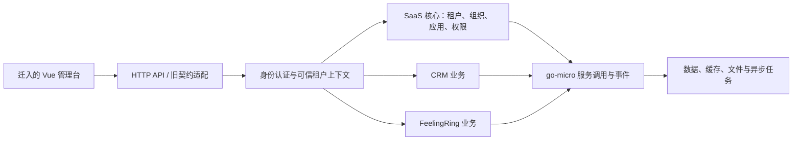

# Kerthus SaaS 底座：旧项目探索与重构依据

探索日期：2026-09-11。本轮由前端、后端两个 agent 分别探索旧项目，主 agent 检查 Kerthus 并交叉核对 API。本轮产物是架构与契约梳理；尚未搬迁前端、生成 Go 服务或验证运行链路。

后续范围已明确：使用 go-micro 迁移 SaaS 基础底座，前端优先复用。当前迁移清单以 [SaaS 基础底座迁移要点](/Users/alex/golang/src/kerthus/docs/migration/saas-foundation-plan.md) 为准；下文其他业务域仅保留为原始项目探索记录。

## 阅读入口

- [旧后端架构与迁移分析](/Users/alex/golang/src/kerthus/docs/discovery/legacy-backend.md)：业务域、数据模型、HTTP/RPC、租户权限、基础设施、迁移风险与服务边界。
- [旧前端架构与搬迁分析](/Users/alex/golang/src/kerthus/docs/discovery/legacy-frontend.md)：页面、动态路由、状态、请求协议、组件复用与迁移阻碍。
- [API 交叉映射](/Users/alex/golang/src/kerthus/docs/discovery/api-contract-map.md)：168 个明确的前端方法/路径与后端源码对应关系。

源码引用使用本机绝对路径与行号，便于直接回到旧项目核对；移动旧目录后需更新链接。

## 当前判断

1. **旧后端已有 SaaS 核心业务模型。** System 域包含账号、租户、应用、资源、组织、员工、岗位、角色与数据权限，可作为新底座领域设计的来源。旧实现使用 PHP/Hyperf，并已有 HTTP 层、RPC 接口、服务和模型分层。
2. **旧前端具备复用价值，但搬迁需要配套兼容接口。** 它是 Vben Admin 衍生的 Vue 3 管理台，包含真实平台管理页面及 CRM、FeelingRing 业务。登录结果、请求头、返回包装和服务端动态菜单都与旧后端紧密耦合。
3. **通用底座与业务应用需要明确边界。** 租户/账号/组织/权限/应用授权属于平台核心；CRM、婚恋会员/活动/订单、投放与联盟统计宜作为业务模块接入。不能将婚恋会员订单直接视为 SaaS 订阅计费。
4. **保留契约需要逐项判断。** URL、字段和动态菜单结构可以在 HTTP 层适配；由客户端租户头推导管理权限的旧行为应在重构中修正。
5. **旧工作树还不是已验证的可运行迁移基线。** CRM/FeelingRing 源码引用的部分数据库连接、RPC server 未出现在当前默认配置中，也没有完整版本化数据库迁移；仍需核对外部配置覆盖、真实 schema 和菜单种子数据。证据详见后端报告“数据与迁移完整性”。

## Kerthus 的起点

- `/Users/alex/golang/src/kerthus` 当前为 `main` 分支、尚无提交和已跟踪源码；本轮开始时只有 `.git` 与未跟踪的 `.local`。
- 没有 `go.mod`、前端 `package.json`、业务实现或既有测试，因此暂不存在需要延续的应用架构。
- `.local` 为已有本地状态与配置，本轮仅查看文件名，不复制或读取凭证内容，也不据此假定生产部署架构。
- 两个旧项目均存在既有工作树修改；报告基于当前工作树，不能当作某个已发布版本的说明。后续搬迁前需确定源代码快照。

## 前端迁移最关键的协议

| 契约 | 当前观察 | Go 重构时的处理建议 |
| --- | --- | --- |
| 登录 | `/system/user/login` 返回 `access_token`、`expires_time` 及租户/应用/组织上下文 | 先建立字段兼容 DTO，服务端验证用户与租户、应用的关系 |
| 请求上下文 | `access-token`、`tenant-id`、`unit-id`、`section-id`、`app-id` | HTTP 层接收旧头；校验后生成可信的内部调用上下文 |
| 返回包装 | 前端依赖 `{code, data, msg}`，业务成功码为 `0` | HTTP 适配层集中包装，明确 HTTP 状态与业务错误码的关系 |
| 动态权限 | `/system/user/auth` 返回 `menus/routes/roles/permissions` | 保留前端所需结构，覆盖菜单树、组件路径、按钮权限与接口授权 |
| 列表/分页 | 旧列表协议及页面查询字段与组件配置关联 | 按实际控制器和页面取样固定请求/返回样例，避免仅凭 TypeScript 类型推断 |
| 上传 | 独立上传路径与上传客户端 | 单独核对 multipart 字段、鉴权、返回格式及存储地址 |
| GET 写操作 | 旧控制器存在 GET 删除/状态变更 | 若保留旧入口，集中放在兼容层并明确其鉴权、缓存与重试行为 |

登录字段证据：[userModel.ts:14](/Users/alex/html/dating.saas/src/api/common/model/userModel.ts:14)。完整协议证据及例外见前后端报告。

静态扫描 `src/api` 中枚举 URL 的直接 `defHttp` 调用，得到 **168 个唯一 HTTP 方法/路径，153 个与后端声明匹配，15 个未匹配**。这不是端到端通过率，也不表示这些封装全部被真实页面使用。未匹配项包括 11 个 `/system/rcc/*`，以及 location、getSeatItems、模板菜单与重试接口。详见交叉映射的统计口径。

## 建议的目标结构（待实施验证）

图中表示职责边界，不代表每个方框都要成为独立进程。建议先验证 HTTP 入口与 SaaS 核心服务的最小闭环，再依据事务边界、独立部署需要拆分业务服务。

- **HTTP API 层**：负责旧前端 DTO、错误码、上传协议、请求关联标识与兼容路径，不承载核心领域规则。
- **身份与 SaaS 核心**：负责账号会话、租户成员关系、组织、角色、资源与应用授权；关键授权应在服务层再次校验，不能仅依赖入口路由检查。
- **业务服务**：以 CRM、FeelingRing 等实际业务域组织，通过明确服务契约访问平台能力。
- **基础设施适配**：把数据库、缓存、消息、存储和第三方调用放在适配层，明确业务数据归属、幂等与失败重试语义。

用户已指定后端使用 go-micro。2026-09-11 核对官方仓库发现，当前主干模块路径为 `go-micro.dev/v6`，并声明 Go 1.25.0；因此不沿用旧教程直接锁定 v4/v5，也不把主干当作本项目已选定的发布版。落地时需要验证固定 release、Go 工具链、RPC/服务发现插件与最小通信样例。[官方 go.mod](https://github.com/micro/go-micro/blob/master/go.mod)、[官方 releases](https://github.com/micro/go-micro/releases)。

## 建议的实施顺序

1. **固定迁移基线**：确认两个旧项目使用的工作树快照，补齐数据库结构、初始化数据与真实部署依赖清单。
2. **固定平台契约**：优先覆盖登录 → profile → auth → 动态菜单 → 组织/员工/角色的请求与响应样例，并列出兼容与有意变更项。
3. **搭建 Go 最小闭环**：确定 go-micro 发布版本，实现 HTTP 入口、核心服务调用、数据库迁移、会话与可信租户上下文；用两个租户验证访问隔离。
4. **迁入前端基础管理能力**：复用布局、组件及 system/basic 页面，修复构建问题与失配契约，打通平台闭环。
5. **逐域迁入业务**：根据产品范围接入 CRM、FeelingRing 和第三方能力；为每个业务域独立列迁移数据、外部依赖与验收用例。
6. **补齐通用产品能力**：若目标包含 SaaS 商业化，另行设计订阅套餐、权益、配额、租户开通/停用、审计与运维流程，并检查旧模型可复用的部分。

## 进入实施前需要明确的产品事项

这些是后续设计输入，不影响本轮探索完成：

- 第一个可交付版本覆盖通用管理底座，还是同时包含 CRM/FeelingRing。
- 平台运营管理台与租户工作台是否共用一个前端，以及租户/应用切换体验。
- 是否迁移真实存量数据与会话，还是新环境初始化；是否需要与旧 PHP 服务并行运行。
- SaaS 套餐、权益和配额是否纳入首期；租户隔离是否有独立数据库要求。
- 呼叫中心、微信、支付等外部能力的实际使用范围与可用测试环境。

## 验证边界

本轮执行源码阅读、依赖声明检查、路由实现核对和 API 静态映射。未安装依赖、启动服务、连接数据库或第三方服务，也未执行前后端构建及端到端测试。源码存在不等于部署已可用；报告中的目标结构与顺序为初步建议，尚非最终架构决策。
