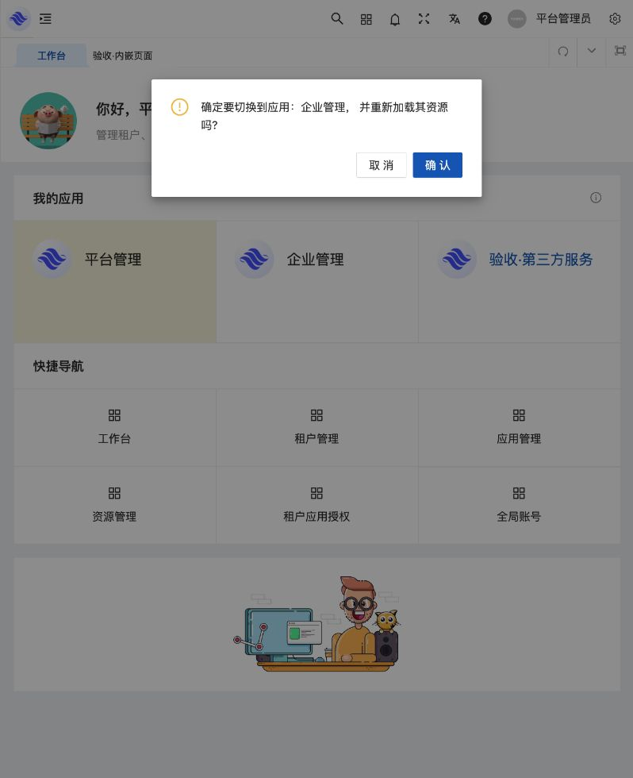
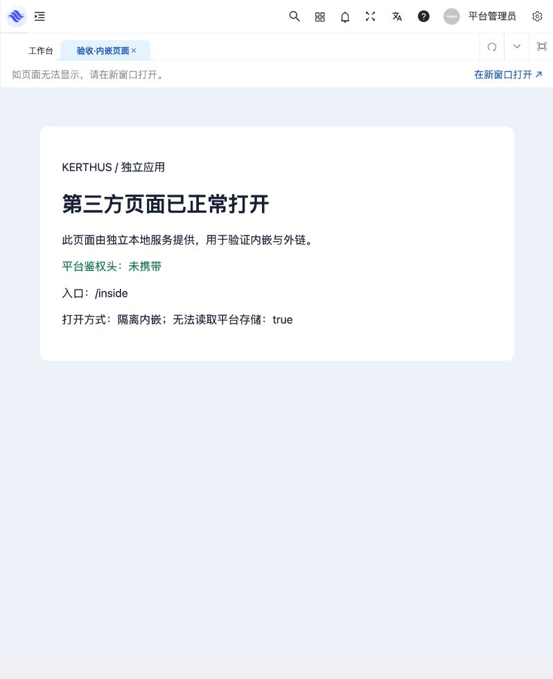

# SaaS 基础底座补齐与验收（2026-09-12）

仅补齐 SaaS 基础能力，继续复用原前端，未迁移婚恋、CRM、呼叫中心等业务应用。

## 已补齐

| 能力 | 最终行为 |
| --- | --- |
| 旧超长密码 | 按原 PHP 算法验证完整字节，成功登录后升级标准 Argon2id PHC；不截断前 72 字节，不改变新密码 10–72 字节策略。原短密码继续 bcrypt。 |
| 通用附件 | 图片公开链接仍为 PNG/JPEG/WebP、10 MiB；通用附件默认私有、50 MiB 可配置。流式暂存/上传、4 并发限制、失败取消、中文下载名；下载按当前租户、应用和资源授权校验。 |
| 第三方应用 | 恢复 type/url/is_public，兼容 thrid。创建草稿→启用→租户开通→打开网址；不需要站内资源，不成为 SaaS 默认应用或后端上下文。 |
| 内外链资源 | inside 的 path 为站内路由、component 为 HTTP(S) 页面；outside 的 path 为外部地址，仅出现在菜单，不注册 Vue 路由、不作首页、不允许子节点。 |
| 后续应用定义 | manifest 支持可选 open_with/redirect；内外链保持路径和 URL 校验，空可选字段不改变现有清单摘要。 |

公开属性只是原应用目录字段，原后端未以它绕过租户开通，本实现保持这一边界。第三方地址是浏览器导航目的地，不是服务发现地址、RPC 代理或 SSO：不附加平台 token、租户/应用上下文。应用类型创建后不可变，受控 Go 服务应用不能转换成外部链接。

组件资源在核心校验路径格式与应用命名空间；清单发布还会验证前端文件存在。资源、应用的 ID 和现有授权不因展示字段变化而重建。

附件详细约定见 [附件接口](attachments.md)，前端路由与调用方式见 [前端实现](third-party-links-2026-09-12.md)。

## 数据和运行环境

当前目标仍为本机 3306/kerthus_saas，原 beehive_saas 只读。已备份 `.local/kerthus-saas-before-foundation-completion.sql`（0600），只执行增量迁移 008/009，分别增加应用类型/地址/公开字段及文件名称/私有字段；没有重新 seed/import。

迁移前后对 19 张业务表的所有既有列做 SHA-256 比对，全部一致。62 账号、45 租户、62 成员、5 应用、140 资源、49 角色、744 授权、49 开通保持不变。存量 5 个应用都是 self/私有/空 URL，新列默认值与原库比对差异为 0，无需覆盖数据。

Core/Gateway/管理台已更新运行于 19090/18080/15173；健康检查及文件上限接口正常。真实账号未被测试登录或改密，页面当前需要重新登录。

## 验证

- `go test ./...`、`go vet ./...`、应用边界检查通过。
- 全量隔离 MySQL `-race` 回归通过，核心 142.681 秒；新应用专项 8.830 秒。
- 旧长密码测试含原 PHP 固定样本、中文/NUL、相同前 72 字节不同后缀、格式拒绝、改邮箱/改密、单多会话及并发重置/停用/撤权。
- 附件核心与网关 race 覆盖跨租户/应用、禁用、过期、撤权、失败清理，以及用户退出后清理 pending；已确认文件不可由 Cancel 删除。
- [实际 HTTP 附件验收](visual-acceptance-2026-09-12/attachments-http-report.json)通过：中文 PDF 上传到 MinIO、下载字节一致、HEAD、B 租户/错误应用/匿名/公开私有路径拒绝，旧公开图片兼容。
- 前端类型检查、URL 边界测试、最终生产构建通过（44.94 秒）。

内置浏览器 15174 合成环境实际操作：第三方表单拒绝 javascript 地址；有效应用创建、启用；给合成租户青禾开通无资源第三方应用，成功提示与已开通状态回填；资源管理保存顶层 inside/outside 并正确回显。

另修复 Logo 硬编码跳转 `/dashboard` 的原有缺口，改为实时读取当前已授权首页；固定标签使用完整路径。内嵌页→固定工作台标签、内嵌页→Logo 均已在 DOM/实际 URL 中复验为 `/system/dashboard`。

顶层 inside 页面已实际加载，iframe 的 sandbox 不含 same-origin/顶层导航权限，referrerpolicy=no-referrer；独立页面确认无法读取父页面存储，服务端没有收到平台鉴权头。外链出现在菜单，Vue 路由过滤由回归验证。

第三方卡片为原生可访问链接；点击后平台路径保持，独立目标服务已收到 /third 请求，不带平台鉴权头/Referer或附加参数。弹出目标没有出现在内置浏览器的标签清单，因此独立窗口未作为浏览器截图通过项。

自建应用切换确认框仍保持正常留白、图标、确认/取消布局，切换流程已浏览器回归。

隔离 15174/54738 和外部测试页 15175 已停止，合成数据库、对象桶和会话由 supervisor 清理；实际服务 15173/18080/19090 保留运行。

## 明确边界

第三方网站可能禁止被 iframe 嵌入，或因沙箱不允许同源存储而无法完整使用；界面固定保留新窗口入口。公开应用不等于自动给全体租户开通。附件目前提供基础存储/下载，业务归属和业务删除由未来应用定义；同租户、同应用的有效授权成员可以下载该应用附件。对象存储或数据库整体故障时的 pending 清理需要运维重试。
