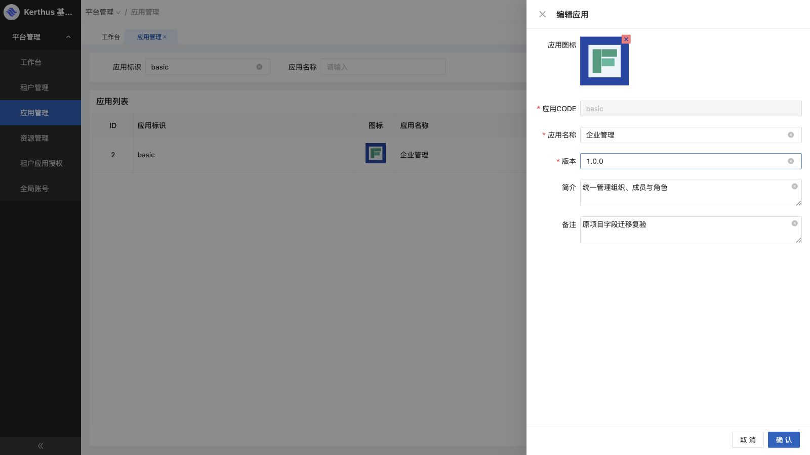
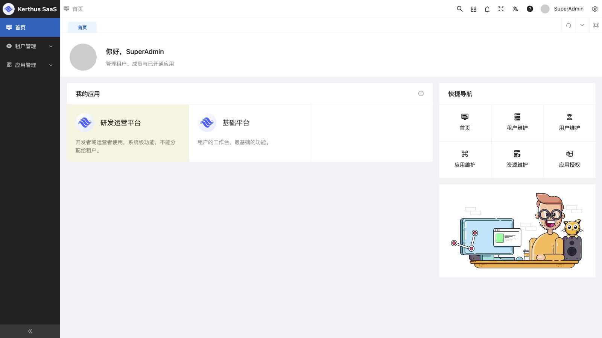

# 原项目前后端对照复核与修复

日期：2026-09-11。原后端 `/Users/alex/wwwroot/service.beehive`，原前端 `/Users/alex/html/dating.saas`，当前项目 `/Users/alex/golang/src/kerthus`。

三个 agent 分别对照前端、基础领域和认证权限，主任务补查网关转换、筛选排序与资源字段，执行修复、回归及数据库补齐。范围仅为 SaaS 基础底座，原项目只读。

## 发现与修复

| 项目 | 问题及原实现依据 | 本轮结果 |
| --- | --- | --- |
| 租户详情撤权 | queryTenantApps 行的 id 是 App ID，撤权需要 TenantApp ID；旧页面也有此混用，碰号可能撤掉其他租户记录 | 查询返回独立 tenant_app_id；缺失禁用，不回退应用 ID |
| 批量撤权勾选 | 固定首次空数组与后续 ref 更新脱节，显示选择和提交集合可能不一致 | 统一表格选择状态，成功后清空，空集合禁用按钮 |
| 应用展示资料 | 旧 Model/App.php 有 icon/desc/remark，迁移存储、导入、DTO 和前端编辑不完整 | 补齐全链路；注册升级保留已有展示资料 |
| 租户应用期限与分页 | 旧 EmployeeController 返回开通期限；当前查询丢失期限、忽略分页搜索，有限期显示永久 | 返回目标租户真实开通 ID/期限，SQL 过滤后分页计数 |
| 应用与授权筛选 | 页面有 code/name、tenant_name/app_name，网关忽略部分参数 | 显式契约字段，组合取交集，在分页计数前执行 |
| 资源配置字段 | 旧 Model/AppResource.php 有 redirect/remark/open_with，迁移丢值且打开方式硬编码 route | 保留并返回三个字段；组件可编辑，旧不支持方式保留原值并限制编辑执行 |
| 树排序 | 旧组织/资源 DAO 按 sort 排序，当前完整列表助手强制 ID | 恢复默认 sort，保留显式排序；同值按 ID 稳定排列 |
| 有效选项 | 旧 getItems 排除停用岗位和未审核启用租户，迁移通用查询没有区分 | 恢复选项过滤，管理列表保留非有效记录 |
| 详情身份 | tenant/org/employee info、app getResource 缺少 ID 时会返回首条 | 查询前要求正 ID，避免误展示其他记录 |
| 单位数据范围 | Go 对 scope 1/2 的树展开比旧 ScopeUnit/DaoTenantOrg SQL 更宽 | scope 1 为当前单位及 unit_id 属于该单位的部门，排除独立子单位；scope 2 仅单位节点直接成员，无组织为 None |
| 重复邮箱写入 | 新邮箱可与别人冲突，使双方邮箱登录均因歧义失败 | 资料更新、新成员、审核开户均在事务内拒绝新增冲突；旧重复原值允许保留，并发只一人成功 |
| 新账号单会话 | 旧 is_signal_login 默认 1，新建账号却默认多会话 | 新成员、审核开户、平台初始化默认单会话；既有账号策略不改 |
| 表单初始化 | 改密/锁屏取消重开保留密码草稿；四个表单 reset/set 未串行 | 每次打开清空密码，异步清空完成后回填 |

主要代码：[网关](../../internal/gateway/gateway.go)、[完整列表排序](../../internal/gateway/pagination.go)、[资源 DTO](../../internal/gateway/catalog.go)、[查询](../../internal/saas/usecase/core/query.go)、[保存](../../internal/saas/usecase/core/save.go)、[权限范围](../../internal/saas/usecase/core/authorization.go)、[邮箱冲突](../../internal/saas/usecase/core/email.go)。

[前端对照明细](frontend-parity-review-2026-09-11.md)包含原/新文件位置、核对范围与静态结论；本报告补充集成验证结果。

## 当前数据库已补齐

补齐前备份当前 `kerthus_saas` 到 `.local/kerthus-saas-before-parity-fix.sql`，权限 0600。执行迁移 006、007 后运行 [补齐脚本](../../scripts/backfill-legacy-display.sql)，按原 ID + Code 匹配，资源另匹配 App ID，仅填充目标空值，不覆盖当前非空字段。

实际补齐应用 5 行、资源 140 行。图标/简介/备注、资源重定向/打开方式/备注与源字段比对差异均为 0。补齐前后对账号身份、密码摘要、认证版本、单会话设置、租户状态/期限、资源身份/状态/父级、应用开通及角色授权做指纹比对，结果一致。原库未写入，账号和授权未重新导入。

真实存量没有 scope 1/2，本次没有修改授权数据。旧重复邮箱及已有账号单/多会话设置保留。真实 Core/Gateway 已更新运行，19090/18080 健康检查成功，15173 前端保持运行，原账号会话仍可进入工作台。

## 回归与浏览器证据

| 检查 | 结果 |
| --- | --- |
| go test ./...、go vet ./...、架构边界检查 | 通过 |
| python3 scripts/test-integration.py，完整隔离 MySQL race | 通过，核心约 105.66 秒 |
| 新增专项回归 | 覆盖邮箱并发/旧值、新账号会话、单位范围、应用字段/期限/分页、有效选项、资源字段/排序、网关参数、详情 ID |
| 前端 yarn type:check | 通过，约 10.96 秒 |
| 最终前端 yarn build | 通过，约 32.51 秒 |
| 真实字段比对与网关健康检查 | 通过 |

内置浏览器在独立 15174 合成环境实际复验：

- 应用编码不存在时为空，basic 仅返回基础应用。
- 合成图标通过文件选择器上传；简介、备注保存后重新编辑，三个字段完整回显。
- 授权“青禾 + 平台管理”组合为空，“青禾 + 企业管理”为一条；勾选/取消与按钮状态同步。
- 远山租户详情 App ID=2，对应 TenantApp ID=4；撤权只删除 ID=4，平台 ID=1/2 和青禾 ID=3 保留。随后总表批量撤销青禾，只删除 ID=3，选择清空。
- 改密输入合成草稿后取消，重开三个密码输入均为空，未提交改密。
- 真实 15173 工作台显示补齐的原应用简介，原会话有效。

资源重定向、同值排序分页、范围、邮箱并发、有限期等由自动化回归验证，未全部标作本轮浏览器逐项通过。隔离服务已停止，临时配置已清理；真实服务保留。

## 当时保留的差异与边界

2026-09-12 已继续补齐通用附件、第三方应用、内外链和旧超长密码，以下为本轮结束时的历史状态。当前实现及验收见 [后续补齐记录](foundation-completion-2026-09-12.md)。

- 原“单点登录”指单会话互踢，不是 SSO；原 SaaS 登录实际支持手机号/邮箱 + 密码。没有找到短信、SSO、MFA、站内通知完整基础账号链路，不将旧演示入口算成已迁移功能。
- 当前上传用于头像/Logo，支持已认证的 PNG/JPEG/WebP、10 MB 图片；旧七牛任意附件能力未全部迁入。旧图片仍依赖原静态源，未搬迁二进制文件。
- 第三方/公开应用、资源内外链完整执行尚未实现。历史资料保留并限制执行；新业务应用需通过 manifest 和 HTTP 契约注册。
- **旧密码超过 72 字节的兼容仍有限制**：旧算法接受此长度，当前登录仍拒绝。无法从摘要判断真实账号是否受影响，本轮未改变存储算法或重置用户密码。
- 共享全局账号修改限制、空组织范围不放开权限、改密撤销会话、停用/撤权即时生效等安全收紧保留，不复制原实现漏洞。
- CRM、婚恋、呼叫中心、支付及旧占位日志页不属于本次基础底座。生产压测和全面渗透测试不在本轮结论内。
