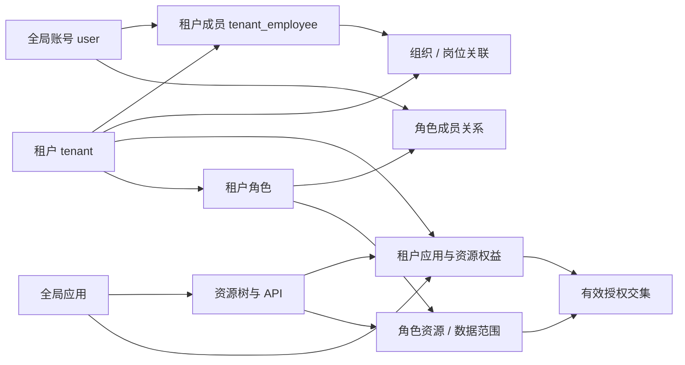

# SaaS 基础领域迁移复核

日期：2026-09-11。目标：将旧 `service.beehive` 的 SaaS 基础底座迁入 Go Micro，前端复用；本报告不包含 CRM、婚恋、投放、呼叫中心实现。

依据为旧项目**当前工作树**的 System Controller / Service / Logic / DAO / Model。已读 discovery 后重新核对源码。相关源目录与祖先目录未发现适用 `AGENTS.md`。没有读取密钥、访问数据库或外部服务、运行旧后端、修改旧项目或实现 Go。文中的“已实现”仅指有源码路径；“缺陷”是静态控制流/参数/字段矛盾；真实 schema、数据及运行效果仍待验证。

## 1. 范围决策

| 分类 | 本轮边界 | 理由 |
| --- | --- | --- |
| 必须迁移 | 全局账号/资料、登录会话、租户、租户成员、单位/部门树、岗位及关联、默认租户/应用/组织上下文 | 构成旧后台身份与管理页面的最小业务模型 |
| 必须迁移 | 全局应用目录、应用资源/API、租户开通应用及资源、角色/成员/资源/数据范围、动态菜单与按钮权限 | 前端导航依赖数据库资源；必须同时约束租户权益与用户授权 |
| 必须迁移 | 租户初始化、审核/停用/删除/到期、成员移除、权益撤销、权限变更生效 | 这是基础业务闭环，不能只迁 CRUD |
| 平台按需 | 地区/行业等字典、文件上传、操作审计页面、组织授予角色、字段权限执行器 | 字典/文件按复用页面需要接入；关键操作审计机制仍应首期具备。组织角色只有部分实现，不能称成熟能力 |
| 暂不纳入 | 院校/快递等与基础表单无关的字典、`tenant_asset*` 余额/充值、套餐订阅/账单/支付 | 余额/充值只有 Model 不能算订阅计费底座；应用有效期不等于完整商业化体系 |
| 明确排除 | CRM、婚恋、营销集成/投放/统计、Noctua、呼叫中心及这些模块的数据、队列、第三方 API | 本轮只迁基础底座，无需兼容这些业务路径 |

建议首期采用 **HTTP gateway + 一个 Go Micro SaaS 核心进程**，核心内部划分 identity、tenant、organization、application、access 模块。旧 System 的主要写事务都在 `default` 连接，初始化与员工操作跨多个模块；按旧 RPC 类拆十个进程会把可用本地事务解决的问题变成分布式事务。本建议是迁移设计，不是已实现架构。[员工写入](/Users/alex/wwwroot/service.beehive/app/Services/System/ServiceSystemTenantEmloyee.php:50)、[角色删除](/Users/alex/wwwroot/service.beehive/app/Services/System/ServiceSystemTenantRole.php:60)、[应用撤销](/Users/alex/wwwroot/service.beehive/app/Services/System/ServiceSystemTenantApp.php:87)

## 2. 实际核心表与关系

所有下表都有 `id`、`created_at`、`updated_at`；这里列迁移关键字段。字段来自 Model，**不代表数据库 DDL、外键和唯一索引已经存在**。

| 表/领域 | 核心字段与关系 | 源码 |
| --- | --- | --- |
| `user` | 全局 `phone/email/password/name/avatar/sex/status/is_signal_login/is_del`；不是租户私有员工表 | [User:10](/Users/alex/wwwroot/service.beehive/app/Services/System/Model/User.php:10) |
| `user_info` | `user_id/idcard/remark/position_status`，DAO 声明一对一；在职状态当前存全局资料，跨租户语义可疑 | [UserInfo:10](/Users/alex/wwwroot/service.beehive/app/Services/System/Model/UserInfo.php:10)、[关联](/Users/alex/wwwroot/service.beehive/app/Services/System/Dao/DaoUser.php:177) |
| `tenant` | 名称/logo/信用代码/联系人/地址、`register_type`、`verify_status/status/is_del/expiration_time` | [Tenant:10](/Users/alex/wwwroot/service.beehive/app/Services/System/Model/Tenant.php:10) |
| `tenant_employee` | `tenant_id/user_id` 成员关系；`app_id/unit_id/section_id/is_default/is_del` 保存默认上下文；没有成员独立 `status` | [TenantEmployee:10](/Users/alex/wwwroot/service.beehive/app/Services/System/Model/TenantEmployee.php:10) |
| `tenant_org` | `tenant_id/parent_id/unit_id/type(unit,section)/name/short_name/status/is_del/sort`，含冗余 `parent_name` | [TenantOrg:10](/Users/alex/wwwroot/service.beehive/app/Services/System/Model/TenantOrg.php:10) |
| `tenant_employee_org` | `tenant_id/user_id/unit_id/org_id/is_del`；一人多组织 | [TenantEmployeeOrg:10](/Users/alex/wwwroot/service.beehive/app/Services/System/Model/TenantEmployeeOrg.php:10) |
| `tenant_position` / `tenant_employee_position` | 岗位 `tenant_id/org_id/name/status`；关联 `tenant_id/user_id/position_id/is_del`；一人多岗位 | [岗位](/Users/alex/wwwroot/service.beehive/app/Services/System/Model/TenantPosition.php:10)、[关联](/Users/alex/wwwroot/service.beehive/app/Services/System/Model/TenantEmployeePosition.php:10) |
| `app` | `code/name/version/type(self,thrid)/is_public/url/status/is_del`；平台全局目录 | [App:10](/Users/alex/wwwroot/service.beehive/app/Services/System/Model/App.php:10) |
| `app_resource` | `app_id/parent_id/type(menu,view,action,field)/code/path/component/meta/open_with/redirect/is_public/is_data_access/status/sort`，含父节点冗余字段 | [AppResource:10](/Users/alex/wwwroot/service.beehive/app/Services/System/Model/AppResource.php:10) |
| `app_resource_api` | `resource_id/code/controller/action/method/uri`，资源关联 API；Go 保留 method/route/code，PHP controller/action 仅兼容元数据 | [AppResourceApi:10](/Users/alex/wwwroot/service.beehive/app/Services/System/Model/AppResourceApi.php:10) |
| `tenant_app` | `tenant_id/app_id/expiration_time`，冗余 `tenant_name/app_name`；无独立 status、软删除 | [TenantApp:10](/Users/alex/wwwroot/service.beehive/app/Services/System/Model/TenantApp.php:10) |
| `tenant_app_resource` | `tenant_id/app_id/resource_id`，租户获得资源集合 | [TenantAppResource:10](/Users/alex/wwwroot/service.beehive/app/Services/System/Model/TenantAppResource.php:10) |
| `tenant_role` | `tenant_id/code/name/status/remark`；code 创建时生成，修改不可变 | [Model](/Users/alex/wwwroot/service.beehive/app/Services/System/Model/TenantRole.php:10)、[DAO](/Users/alex/wwwroot/service.beehive/app/Services/System/Dao/DaoTenantRole.php:78) |
| `tenant_role_item` | `tenant_id/role_id/type/item_id`；type=0 用户、type=1 组织，**不是 `user_id` 列** | [TenantRoleItem:10](/Users/alex/wwwroot/service.beehive/app/Services/System/Model/TenantRoleItem.php:10) |
| `tenant_role_resource` | `tenant_id/role_id/app_id/resource_id/data_access`；范围 0 全部、1 单位含下级、2 单位、3 部门含下级、4 部门、5 自己 | [Model](/Users/alex/wwwroot/service.beehive/app/Services/System/Model/TenantRoleResource.php:10)、[范围分发](/Users/alex/wwwroot/service.beehive/app/Services/System/ServiceSystemTenantEmloyee.php:157) |

组织授予角色的 DAO 支持 `org_ids` 分支，但当前 Service 调用 `getTenantUserRoleIds(tenant_id,user_id)` 没传组织集合。因此首期保留直接用户角色，组织继承列为可选补全，不能默认认为旧系统已生效。[DAO](/Users/alex/wwwroot/service.beehive/app/Services/System/Dao/DaoTenantRoleItem.php:46)、[调用](/Users/alex/wwwroot/service.beehive/app/Services/System/ServiceSystemTenantRole.php:121)

## 3. 生命周期与必须纠正的问题

| 路径 | 已实现事实 / 缺陷 | Go 迁移要求（建议） |
| --- | --- | --- |
| 租户创建/保存 | 只保存 tenant；不是包含管理员的完整开户。[Service](/Users/alex/wwwroot/service.beehive/app/Services/System/ServiceSystemTenant.php:57) | 明确 CreateTenant 与 Approve/BootstrapTenant 命令和状态转移 |
| 审核初始化 | `verify` 先写任意审核结果，随后无条件 `setTenantResources`。初始化仅在有应用时创建根组织、运营岗位、管理员角色及资源、联系人账号和角色关系；无总事务/幂等防重。拒绝、重复审核、部分失败均可能产生错误状态。[Controller:143](/Users/alex/wwwroot/service.beehive/app/Http/Module/System/Controllers/TenantController.php:143)、[初始化:196](/Users/alex/wwwroot/service.beehive/app/Services/System/ServiceSystemApp.php:196) | 仅合法“通过”转移触发初始化；事务包住状态与全部关系；初始凭据改为激活/重置流程 |
| 租户禁用/删除/到期 | 禁用后异步按成员 user_id 清 Token；删除仅 `is_del=1`。登录读默认租户时过滤租户状态/审核/删除并比较租户到期，已登录请求的生命周期校验不在此路径。[禁用/删除](/Users/alex/wwwroot/service.beehive/app/Http/Module/System/Controllers/TenantController.php:97)、[登录](/Users/alex/wwwroot/service.beehive/app/Services/System/Form/FormUser.php:106) | 每个受保护请求使用当前租户生命周期/版本；禁用 T1 只撤销 T1 上下文，不能意外注销该账号在 T2 的业务 |
| 员工新增/更新 | 先写全局账号，再开启员工/组织/岗位事务；直接取 orgs[0]；空组织/岗位列表不清旧关系；每次 saveEmployee 将当前租户设默认但不清其他默认。[saveEmployee:50](/Users/alex/wwwroot/service.beehive/app/Services/System/ServiceSystemTenantEmloyee.php:50) | 同进程单事务，先校验组织/岗位所有权；明确全量替换与局部更新；空列表可真正清空；不得由租户操作越权修改全局身份 |
| 员工移除/重加 | 移除只软删成员、组织、岗位关联，没有移除角色关联/默认上下文/权限缓存。默认租户读取遗漏成员 `is_del=0`，成员重存也未恢复 is_del。[移除:91](/Users/alex/wwwroot/service.beehive/app/Services/System/ServiceSystemTenantEmloyee.php:91)、[默认读取:44](/Users/alex/wwwroot/service.beehive/app/Services/System/Dao/DaoTenantEmployee.php:44)、[保存:83](/Users/alex/wwwroot/service.beehive/app/Services/System/Dao/DaoTenantEmployee.php:83) | 移除事务同时撤销角色关系和上下文，立即拒绝访问；重加明确是恢复还是新成员，默认不恢复历史权限 |
| 默认上下文 | `setEmployeeDefault` 未传 is_default，Service 默认 0，DAO 直接覆盖；可把唯一默认租户清掉。DAO 在 unit_id=0 时改写为 section_id。[Controller:203](/Users/alex/wwwroot/service.beehive/app/Http/Module/System/Controllers/EmployeeController.php:203)、[DAO:83](/Users/alex/wwwroot/service.beehive/app/Services/System/Dao/DaoTenantEmployee.php:83) | “选择租户”和“选择应用/组织”分开；只对已存在有效成员变更；默认值是偏好，不是授权证据 |
| 账号更新 | 通用 saveData 无论修改哪个字段，都把缺失的 idcard/remark 重置为空，position_status 重置 1；禁用后 getInfo 又按 status=1 读取导致返回空。[Service:66](/Users/alex/wwwroot/service.beehive/app/Services/System/ServiceSystemUser.php:66)、[DAO:87](/Users/alex/wwwroot/service.beehive/app/Services/System/Dao/DaoUser.php:87) | 显式 Patch DTO，区分缺失与清空；账号状态操作不得覆盖资料；全局账号禁用与租户成员禁用分开 |
| 账号软删除 | 登录按 phone/email 取账号，只检查 status=0，未检查 is_del。[Form:41](/Users/alex/wwwroot/service.beehive/app/Services/System/Form/FormUser.php:41) | 删除账号不能登录/使用现有会话；账号唯一标识复用策略需明确 |
| 组织更新/删除 | 更新按裸 id 查找再填充 tenant_id；删除仅阻止启用子节点；硬删后只把 employee_org.org_id 改父节点，未同步 unit_id、成员默认组织、岗位 org_id。[DAO:134](/Users/alex/wwwroot/service.beehive/app/Services/System/Dao/DaoTenantOrg.php:134)、[删除:107](/Users/alex/wwwroot/service.beehive/app/Services/System/ServiceSystemTenantOrg.php:107)、[关联更新:96](/Users/alex/wwwroot/service.beehive/app/Services/System/Dao/DaoTenantEmployeeOrg.php:96) | 所有更新以 tenant_id+id 查找；禁止环/跨租户父节点；首期建议有子节点或引用则拒绝删除，迁移引用另设显式命令 |
| 岗位删除 | 有员工则拒绝，但 hasUser 过滤 status=1，而关联 Model 只有 is_del；真实 DDL 待确认。[DAO:145](/Users/alex/wwwroot/service.beehive/app/Services/System/Dao/DaoTenantPosition.php:145)、[hasUser:27](/Users/alex/wwwroot/service.beehive/app/Services/System/Dao/DaoTenantEmployeePosition.php:27) | 按有效成员关联判断引用；禁用岗位不应默默保留可用组织权限 |
| 应用开通替换 | `saveTenantAppResources` 传 tenant_ids 给 `deleteTenantApp`，后者按 tenant_app.id 删除；租户主键和开通记录主键混用，会删除错误记录或保留旧记录。资源替换未同步清理过期角色资源。[Logic:65](/Users/alex/wwwroot/service.beehive/app/Services/System/Logic/TenantApp.php:65)、[DAO:105](/Users/alex/wwwroot/service.beehive/app/Services/System/Dao/DaoTenantApp.php:105) | 明确 TenantID / TenantAppID 类型；单事务按 tenant_id 调整 entitlement 差集，校验 resource.app_id；被移除权益即时失效 |
| 应用撤销/到期 | deauthorize 在事务中删 tenant_app_resource、tenant_role_resource、tenant_app；未修默认 app_id。getAppIds 仅返回 expiration_time；System 内未见应用到期执行业务拒绝。[撤销:87](/Users/alex/wwwroot/service.beehive/app/Services/System/ServiceSystemTenantApp.php:87)、[读取:39](/Users/alex/wwwroot/service.beehive/app/Services/System/Dao/DaoTenantApp.php:39) | 权益生效同时要求租户有效、应用有效、tenant_app 未到期；撤销/到期后修复或清空默认应用，并使旧权限缓存失效 |
| 角色资源/删除 | 角色资源全删重建、删除角色与成员/资源有事务，但未校验资源为租户已开通集合；移除应用资源只删资源/API，未删租户/角色关联。[Role:20](/Users/alex/wwwroot/service.beehive/app/Services/System/Logic/Role.php:20)、[删除角色](/Users/alex/wwwroot/service.beehive/app/Services/System/ServiceSystemTenantRole.php:60)、[删除资源](/Users/alex/wwwroot/service.beehive/app/Services/System/ServiceSystemApp.php:141) | 授权只能是有效 entitlement 子集；删除/禁用资源联动权限版本，检查引用及父子关系 |

有效 API 授权必须重新计算为“有效租户 + 有效成员 + 有效应用权益 + 启用角色授权 + 启用资源/API”。旧 `getAuth` 菜单依赖租户资源和角色资源两集合，但 API 直接取角色资源；`getAuthApis` 也没有 entitlement 交集，不能把菜单不可见当作服务端拒绝。[ServiceSystemUser:151](/Users/alex/wwwroot/service.beehive/app/Services/System/ServiceSystemUser.php:151)、[getAuthApis:205](/Users/alex/wwwroot/service.beehive/app/Services/System/ServiceSystemUser.php:205)

多角色数据范围当前取 `data_access` **最大数字**（越大越窄），不是自然的授权并集，也不是任意组织范围的真实交集。迁移必须把这个规则列为显式产品决策；保留 0–5 外部枚举，但内部使用 All/None/Scoped 等明确类型。[DaoTenantRoleResource:67](/Users/alex/wwwroot/service.beehive/app/Services/System/Dao/DaoTenantRoleResource.php:67)

## 4. Go 核心不变量与事务边界（建议）

1. 一个全局账号可加入多个租户；租户成员身份唯一键为 `(tenant_id,user_id)`。租户管理员只能管理自己租户的成员属性；全局口令/身份变更须独立授权。`position_status` 如代表入离职，应迁入成员属性，而不是沿用全局共享。
2. 所有角色、组织、岗位、默认上下文关联属于同一 tenant；资源属于指定 app；授权资源不得超过 tenant entitlement。任何对象修改均带可信 tenant_id，不允许单 ID 修改后“改租户”。
3. 默认租户是账号唯一偏好，默认应用/组织是该成员有效关联的子集；无有效默认应进入选择上下文流程。前端请求头只是选择意图。
4. 同一应用资源树不得跨 app、不得有环；组织树不得跨 tenant、不得有环；拒绝删除仍被成员/岗位/子节点引用的节点，除非专门的迁移命令完整处理引用。
5. 租户审核开通：锁 tenant 行，仅允许规定状态转移；以 `(tenant_id,bootstrap_version)` 唯一记录初始化结果，同一版本重试返回原结果，不新建第二套管理员。**同一 Tx** 中写审核结果、根组织、预置角色、成员、组织/岗位/角色关联和对应权益。首次创建全局账号也在此 Tx；对已有账号按已验证身份关联，不按联系人字段静默覆盖全局账号。
6. 应用授权：以 `(tenant_id,app_id)` 唯一约束 upsert；资源 `(tenant_id,app_id,resource_id)` 唯一；一租户权益替换使用期望版本防并发覆盖，外部命令幂等键 `(tenant_id,operation,request_id)`。全删重建不是重试幂等的充分条件。按租户小事务更新差集及角色可用集合；批量平台操作记录每租户结果。
7. 员工保存：账号新建/允许修改、成员、关联、默认值在同一个 Tx；“编辑成员”不重置账号密码或全局资料。角色移除/成员移除/应用撤销在同 Tx 修改关系和权限版本。
8. 事务提交后通过 outbox 或可靠版本校验传播会话/缓存失效和审计。授权执行端需检查当前版本；仅异步清缓存不能成为唯一安全边界。数据库与 Redis 不伪装成一个本地事务。
9. 初始管理员角色用稳定内部标识和唯一约束，显示名称“管理员”不作为幂等依据；保留最后一个有效租户管理员/所有者，防止租户自锁。该保护是新增底座建议，旧表没有显式 owner 字段。

## 5. 必需数据与种子缺口

- 未发现版本化 migration/seeder；文件搜索仅见 `sqls/test.sql`，不能凭 Model 生成等价 DDL。需要脱敏 schema：列类型/默认值/nullable、主键/唯一索引/外键、真实时间单位、软删字段，以及当前数据约束违规统计。尤其 `tenant_employee_position.status` 与 Model 不一致、`insertOrIgnore` 实际依赖哪些唯一键。
- 必需版本化种子：基础 `app`（实际 code/id，不能猜 `basic` 对应 ID）、基础资源祖先链、component/path/meta、按钮/操作 code、method+route 映射；平台管理员独立身份/能力种子；租户管理员角色模板与资源集合。迁移只导出 SaaS 基础资源及所需祖先，不携入被排除业务菜单/API。
- 新租户种子不是导出固定租户的 ID：根组织、预置角色、首个管理员、开通应用应由幂等开户命令产生。保留旧 ID 或导入映射需统一覆盖所有关联和前端枚举，不能逐表重编号。
- 基础租户表单使用的地区字典需明确版本；契约复核确认行业当前仅由垂直业务页面消费，首期可不迁入。`address/address_code` 与 `meta` 等在旧代码按数组 JSON 编码，迁移 DTO 保持数组/对象，不重复编码。[TraitQuery:122](/Users/alex/wwwroot/service.beehive/app/Traits/TraitQuery.php:122)、[租户响应](/Users/alex/wwwroot/service.beehive/app/Http/Module/System/Controllers/TenantController.php:54)
- 存量检查至少覆盖：重复 phone/email、重复成员/多默认成员、软删成员仍有角色、孤儿 org/position/resource、跨租户关联、角色资源超过权益、过期应用仍作默认、同 URI 多 method、角色 code 大整数的前端精度。数据范围语义、状态枚举及长期有效的 0 值要用脱敏样本核对。
- `user_info.idcard/position_status` 是否真要保留在通用 SaaS，需与复用表单一起确认；非基础必要资料不默认扩展到新域。

System 核心 Service 的可执行业务引用均集中在 System 内，未发现要求调用被排除垂直域的链路；可独立迁移。支撑依赖为 MySQL default、Redis 会话/权限缓存、HTTP 中间件与日志、配置字典/文件能力。未使用的 import 不作为服务依赖；旧 `DaoTenantRoleResource` 的 `App\\Services\\Auth\\Model\\AuthRolePermission` import 无使用，不能据此引入另一个 Auth 服务。

## 6. 推荐迁移顺序与验收

1. **冻结基础范围与数据契约**：提取基础资源/API/字典种子及 schema；决定账户与成员字段归属、有效期规则、多角色范围规则；记录存量异常及处理映射。
2. **建立单核心模块和事务设施**：DDL/唯一约束/版本化种子、身份与可信上下文、错误 DTO；HTTP gateway 适配旧前端路径/字段，所有授权在核心再次检查。
3. **闭合平台开户**：应用目录/资源 → 租户创建 → 通过审核并初始化 → 首个管理员激活；先通过幂等及失败回滚测试。
4. **闭合租户管理**：登录/profile/auth → 默认上下文 → 组织/岗位/成员 → 角色资源/API/数据范围 → 复用前端动态菜单和管理表单。
5. **闭合生命周期及切换**：租户/用户停用、成员移除、角色撤销、应用取消/到期、组织引用处理、审计/缓存失效；导入演练并确保一个阶段只有一个后端写 System 数据。

以下用例是迁移完成门槛，全部只使用基础域，不需要 CRM/婚恋作为验证载体：

| 用例 | 应达到的结果 |
| --- | --- |
| 同租户重复/并发审核通过 | 一套根组织/预置角色/管理员成员；相同幂等键返回相同结果；拒绝审核不初始化 |
| 开户每个写步骤注入失败 | 审核状态和全部关联一致回滚，或已记录明确可重试状态；无“已通过但无法登录”的半成品 |
| tenant.id 与 tenant_app.id 故意不同，两个租户并存 | 变更 T1 应用只影响 T1；T2 权益不被误删；重复开通不产生重复记录 |
| 多租户同一账号 | T1/T2 的组织、岗位、角色、成员状态互不污染；T1 管理员不能修改 T2 成员或全局口令 |
| 空 org_ids / position_ids 更新 | 明确清空或明确拒绝无效默认，不保留旧关联假装成功 |
| 移除成员、再次加入、切默认 | 移除即时拒绝，旧角色不隐式复活；重新加入的权限符合初始策略；只存在一个有效默认租户 |
| 跨租户 ID 更新/角色绑定/组织父节点 | 统一拒绝；对象不得被重新归属到攻击方 tenant |
| 组织有禁用子节点/被岗位或成员引用/形成环 | 删除和移动完整校验，不能留悬空引用；成员默认上下文始终有效 |
| 角色含未开通资源、资源已停用、应用已撤销 | 菜单、按钮和直接 API 请求均拒绝，绕过前端仍无权访问 |
| 租户/应用到期边界与 0 长期有效 | 统一时钟和比较规则；已登录用户同样立即受限；仅 T1 到期不损坏 T2 |
| 多角色数据范围、无权限、全部权限 | 按确定的聚合规则输出；All 与 None 不共用空数组；用员工/组织查询构造越界负例 |
| 旧前端基本闭环 | 登录 → auth 动态菜单 → 租户开户 → 组织/岗位 → 员工 → 角色授权 → 登出/重新登录；DTO/分页/JSON 与确认契约一致 |
| 数据导入一致性 | 核心行数/关系/默认值/权益交集对账；重复和孤儿有处理记录；无被排除业务的资源/API 意外开放 |

待产品明确、但不阻塞继续设计的少量决策：是否首期保留人工审核还是创建即开通；租户 owner 是否独立于管理员角色；组织角色继承是否需要；多角色范围聚合规则；成员入离职等字段归属；过期后的续开是否恢复旧角色资源。上述未定项应以保守、可配置的边界实现，不直接复制旧缺陷。
