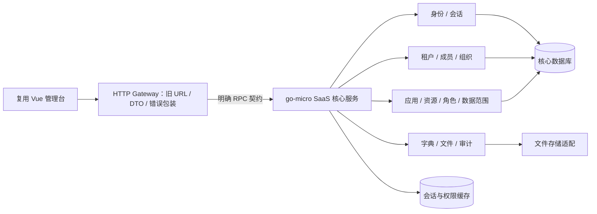

# SaaS 基础底座后端迁移要点

日期：2026-09-11。用户确定的方向：后端使用 go-micro 重构，前端以复用为主；当前迁移确认仅覆盖 SaaS 基础底座。本轮为源码复核与方案收敛，尚未实现 Go 服务。

配套设计：[项目目录、服务关系与依赖规则](/Users/alex/golang/src/kerthus/docs/architecture/project-structure.md)。

后续扩展要求已纳入：[应用注册、开通、授权与独立服务边界](/Users/alex/golang/src/kerthus/docs/architecture/application-extension.md)。当前迁移仍只实现底座，但提前建立应用级契约和数据边界。

## 团队复核与依据

- [领域与数据复核](/Users/alex/golang/src/kerthus/docs/migration/saas-domain-review.md)：核心模型、生命周期、事务、种子数据。
- [认证与授权复核](/Users/alex/golang/src/kerthus/docs/migration/saas-auth-review.md)：可信上下文、租户隔离、应用权益、权限缓存与验收场景。
- [平台契约复核](/Users/alex/golang/src/kerthus/docs/migration/saas-contract-review.md)：复用前端实际依赖的 HTTP 接口、动态菜单与资源编辑器。

此前 discovery 文档是全项目历史探索；本文件收敛当前迁移范围。以下目标规则和部署方式为基于源码的建议，不表示用户已确认所有产品细节。

## 1. 迁移范围

| 模块 | 本次迁移内容 | 边界 |
| --- | --- | --- |
| 身份与会话 | 全局账号、资料、口令、登录/注销、会话过期与撤销 | 全局身份与租户成员分开；租户管理员的身份修改权限需单独约束 |
| 租户生命周期 | 租户建立、审核、初始化、状态、有效期 | 审核通过与初始化组成可重复提交的流程 |
| 成员与组织 | 租户成员、单位/部门树、岗位、归属关系、默认上下文 | 同一账号可关联多个租户，所有关联对象都校验归属 |
| 应用与开通权益 | 应用目录、租户应用、开通/撤销、有效期、租户获授资源 | 沿用“应用+资源+有效期”的模型，不引入新订阅计费产品 |
| 角色与访问控制 | 角色成员、菜单/按钮/API 资源、角色授权、数据范围策略 | 菜单展示、操作权限和资源数据范围分别校验 |
| 导航与接口目录 | auth 动态菜单/路由、页面组件标识、可授权 HTTP 操作目录 | 保留旧前端需要的结构；接口目录不是 go-micro 服务注册表 |
| 平台支持 | 地区字典、必要初始化配置、文件上传、审计记录 | 行业等字典按需扩展；当前平台页面必需的是地区，通用文件与审计不依赖垂直业务 |
| 运行基础 | 数据库迁移、会话/权限缓存、健康检查、配置、日志、RPC 调用 | 先满足平台可运行与可验证，再选择额外基础设施 |

当前范围排除 CRM、婚恋会员/活动/订单、呼叫中心、联盟/投放统计、Noctua、微信支付和其他垂直集成。System 目录中的余额/充值模型也不因目录位置而自动进入底座迁移；套餐、账单、配额是未来扩展，不属于本次旧逻辑迁移。

## 2. 建议的 go-micro 边界

建议首期采用 **HTTP gateway + 一个 go-micro SaaS 核心服务**；核心服务内部按 identity、tenant、organization、application、access、platform-support 分模块。旧 System 的多个 RPC interface 不对应多个必需部署进程。

这是建议的部署边界，不是最终目录或框架 API 设计。理由是旧 System 的关键写操作都集中在 `default` 连接，账号、成员、组织、角色与开通权益高度关联。首期保持同库事务可以修复已有半完成写入，后续按实际负载与所有权演进。证据：[账号保存](/Users/alex/wwwroot/service.beehive/app/Services/System/ServiceSystemUser.php:66)、[员工保存](/Users/alex/wwwroot/service.beehive/app/Services/System/ServiceSystemTenantEmloyee.php:50)、[资源保存](/Users/alex/wwwroot/service.beehive/app/Services/System/ServiceSystemApp.php:116)。

职责约束：

- Gateway 负责旧协议转换、HTTP 参数校验、上传协议与错误包装。内部 RPC 使用明确的命令/查询 DTO，不透传任意 PHP 风格参数 map。
- SaaS 核心服务负责会话验证、有效成员/租户/应用判定、授权、状态变化与事务。RPC 必须识别可信调用方，不能直接信任外部传入的 `tenant_id` 或 `admin` 元数据。
- 一个业务命令统一使用同一个事务对象。不要把“创建账号→加入租户→建组织关系”分别提交后再当作原子成功。
- 按 HTTP `method + route` 建操作目录和权限键；给旧资源编辑器提供稳定的分组/操作标识，避免把内部 Go 包名和 RPC handler 名持久化为前端契约。
- go-micro 的具体 release、Go 工具链、RPC transport、发现/缓存插件在实现最小通信样例时验证并锁定。当前没有 `go.mod`，本轮未选定版本。

## 3. 必须重建的业务规则

| 要点 | 旧源码证据或问题 | 迁移目标 |
| --- | --- | --- |
| 审核初始化 | `verify` 保存审核状态后直接调用初始化；缺少按审核结果分支与整个流程的幂等保证 | 仅批准状态转换触发初始化；重复/并发请求不重复建组织、角色或成员；失败整体回滚 |
| 应用授权标识 | TenantApp 逻辑向按授权记录 ID 删除的 DAO 传入租户 ID | 明确 tenant ID、app ID、tenant-app ID；所有删改同时约束目标归属 |
| 成员更新 | 员工保存先写全局账号，再启动成员关系事务 | 先验证所有输入和归属，再事务提交；区分全局身份与租户资料编辑 |
| 平台管理员 | `tenant-id=1` 可令旧入口绕过 API 权限 | 平台管理身份独立授权；跨租户操作明确目标租户并审计，不由租户编号推导权限 |
| 应用与角色权益 | 角色 API 权限未完整结合租户开通资源与有效期 | 有效权限受成员、租户、应用有效性约束；角色资源不得超出租户获授资源 |
| 删除/停用/到期 | 旧生命周期与会话/权限计算没有统一闭环 | 成员移除、角色撤销、应用撤销/到期等在新请求上生效，菜单和服务端权限一致 |
| 数据范围 | 旧范围计算与具体业务查询通过 AOP 关联，空集合有歧义 | 保留通用策略及组织范围计算；明确 All/Restricted/None，业务查询执行器留为扩展点 |
| 权限缓存 | 旧代码存在变量名错误，当前缓存命中行为不能当可靠设计 | 按用户/租户/应用及权限版本隔离；提交后可靠失效，缓存异常不放宽权限 |

源码与细节见领域、授权报告。审核证据：[TenantController](/Users/alex/wwwroot/service.beehive/app/Http/Module/System/Controllers/TenantController.php:141)。授权 ID 混用证据：[TenantApp logic](/Users/alex/wwwroot/service.beehive/app/Services/System/Logic/TenantApp.php:68)、[DaoTenantApp](/Users/alex/wwwroot/service.beehive/app/Services/System/Dao/DaoTenantApp.php:105)。

推荐初始化唯一键为 `(tenant_id, bootstrap_version)`；组织/角色等自然唯一约束和同一数据库事务共同保证幂等，不能只依靠 HTTP 请求 ID。权限变更提交后可采用版本号校验，或在存在异步投递需求时使用 outbox；不要让关键撤权只依赖一次可能丢失的缓存删除通知。

账号全局停用与租户成员失效必须区别处理：成员从 A 租户移除后，只失去 A 的能力，仍可进入有效的 B 租户；账号全局停用才阻断该账号的全部会话。旧成员模型只有 `is_del`，没有独立停用状态；是否新增成员状态要在 Go 模型中明确，不能误认为已有字段。

## 4. 复用前端时保持的契约

- 旧平台 URL、HTTP 方法、snake_case 字段，以及 `{code, data, msg}` 响应包装；登录保持 `access_token/expires_time` 与上下文字段。
- `access-token/tenant-id/app-id/unit-id/section-id` 作为旧客户端输入格式；服务端根据会话、成员和获授范围验证其合法性。
- 列表使用 `page/pageSize`，返回 `items/total`；排序字段需白名单映射，旧秒时间戳和 ID 类型按真实页面冻结。
- `/system/user/auth` 的菜单/路由树、权限码、`component/path/name/meta/children` 与 `app_code` 需要配套种子数据；迁入页面的组件路径保持稳定。
- `/app/info/servers` 与 `/app/info/routes` 提供旧资源编辑器所需的 HTTP 操作目录。旧代码已明确只选 HTTP server，并筛选带 AccessMiddleware 的操作。[Route.php](/Users/alex/wwwroot/service.beehive/app/Librarys/Route.php:30)
- 上传单独冻结 multipart 字段、鉴权、对象 key 与静态地址拼接协议；普通请求和上传的 Axios 解包方式不能混用。
- 前端最小修补包括上传链路、saasConf 恢复、退出/切换后的动态权限清理，以及隔离权限加载后的条件 SIP 初始化和退出时的 dcc 清理依赖。员工禁用按钮需区分成员状态与全局账号状态。
- 资源 API 编辑器要以 `method + URI` 作为标识，并完整保存关联集合；旧编辑器仅按 URI 去重，且分页读取后全量替换存在丢失关联的风险。验收覆盖同 URI 多方法及超过 30 条关联后保存。[资源 API 编辑器](/Users/alex/html/dating.saas/src/views/system/application/resource/apis.vue:58)

契约复核建议首批保留 **57 个唯一 HTTP 方法/路径**；如保留现有全局账号只读列表页则为 58。该数量是复用页面的 HTTP 兼容面，不包含所有新增生命周期命令或底座内部 RPC。具体端点及实际消费路径以契约报告为准；此前全项目的 168 个接口统计不作为本次底座工作量。

## 5. 数据和初始化先于页面验收

核心数据顺序建议：全局应用/资源/API 与字典 → 账号 → 租户 → 组织/岗位/成员 → 租户应用权益 → 角色与成员/资源关系 → 默认上下文 → 平台审计。

每一步必须明确：原 ID 保留或映射、唯一约束、引用归属、软删除、状态/有效期、时区与时间单位。旧 ORM Model 不能替代真实 DDL；索引、外键、默认值与存量异常需从脱敏 schema 和数据检查中补齐。

新环境应有版本化 schema migration 与可重复执行的最小全局种子：平台管理身份、经前端与存量资源核对的基础应用 code/首页、菜单/操作资源、管理员角色模板与地区字典。旧登录中的 `basic` 是回退 code，不能据此猜定实际应用 ID 或完整资源记录。各租户的根组织、管理员成员和角色实例由幂等开户命令生成，不共享固定租户 ID。平台管理身份使用显式规则，种子不内置通用默认密码。

如迁移存量账号，需制定旧密码校验后升级方案；如迁移现有会话，需额外说明撤销和过期兼容策略。二者不能凭当前源码假定已完成。

## 6. 实施顺序与验收门槛

| 阶段 | 交付内容 | 通过条件 |
| --- | --- | --- |
| A. 基线 | 平台端点/DTO 样例、核心 schema 与种子、固定源工作树 | 平台范围清楚，初始化依赖齐全，排除业务模块不影响启动 |
| B. 骨架 | HTTP Gateway、go-micro 核心服务、数据库/缓存、健康检查 | HTTP→RPC 可调用；受保护的 RPC 拒绝匿名或伪造上下文；依赖故障可识别 |
| C. 身份闭环 | 登录、profile、auth、注销、有效上下文 | 复用前端可登录及刷新；无效/过期会话不能访问；跨账号切换无权限残留 |
| D. 租户组织 | 审核初始化、成员、组织岗位、默认上下文 | 重复审核幂等；组织不可成环；错误归属拒绝；写入失败不留下半份关系 |
| E. 应用授权 | 开通/撤销、资源/API、角色与数据范围 | 授权不超租户权益；撤销/停用/到期后旧会话不能继续操作；同 URI 多方法不串权 |
| F. 平台联调 | 字典、文件、审计、接口目录和平台 CRUD | 现有平台页面可用；两租户隔离用例、分页上传、权限变更回归通过 |

底座完成标准：使用至少两个租户、一个多租户账号、不同角色和两个应用，在复用前端与直接 HTTP/RPC 请求中验证授权与隔离；并证明初始化/授权失败可回滚、重试不重复写。具体场景由三份复核报告补充。

## 7. 尚需产品或环境输入的事项

- 是否需要迁移真实存量数据、保留 ID/账号密码/会话，还是只以旧逻辑建立新数据库。
- 多角色数据范围取并集、交集或显式策略；旧代码选最大枚举，不能自动视作正确产品规则。
- 同一账号在多个租户下，哪些资料为全局，租户管理员可以修改哪些字段。
- 审核拒绝后的再次申请、租户停用/删除和组织迁移的保留/清理策略。
- 实际可用的脱敏数据库 schema、平台资源种子与文件存储测试环境。

这些事项影响后续实现细节；当前已能确定底座范围、关键契约和迁移阻断点。上述输入未到位不等于授权扩大到其他业务。

## 验证边界

本轮为三个 agent 并行源码复核与主 agent 汇总；保留旧项目现有工作树，未连接数据库或第三方、未启动服务、未修改旧项目、未运行编译/端到端测试。报告中的问题为静态证据，迁移目标为待实现验收规则。
