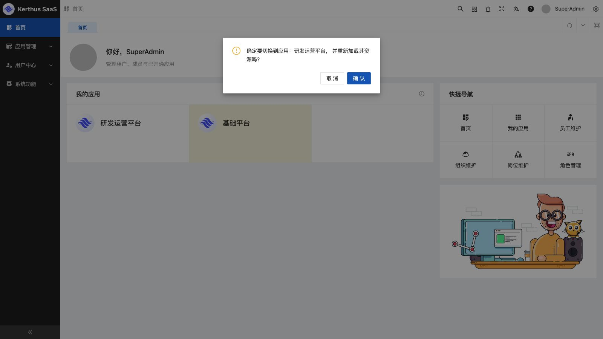
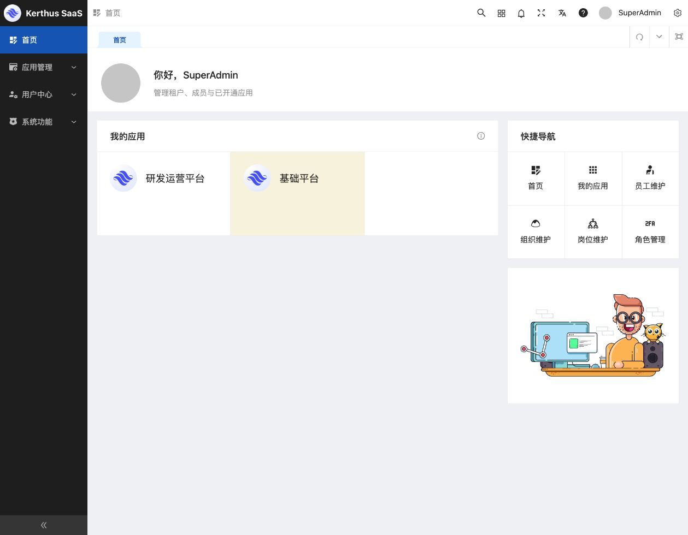
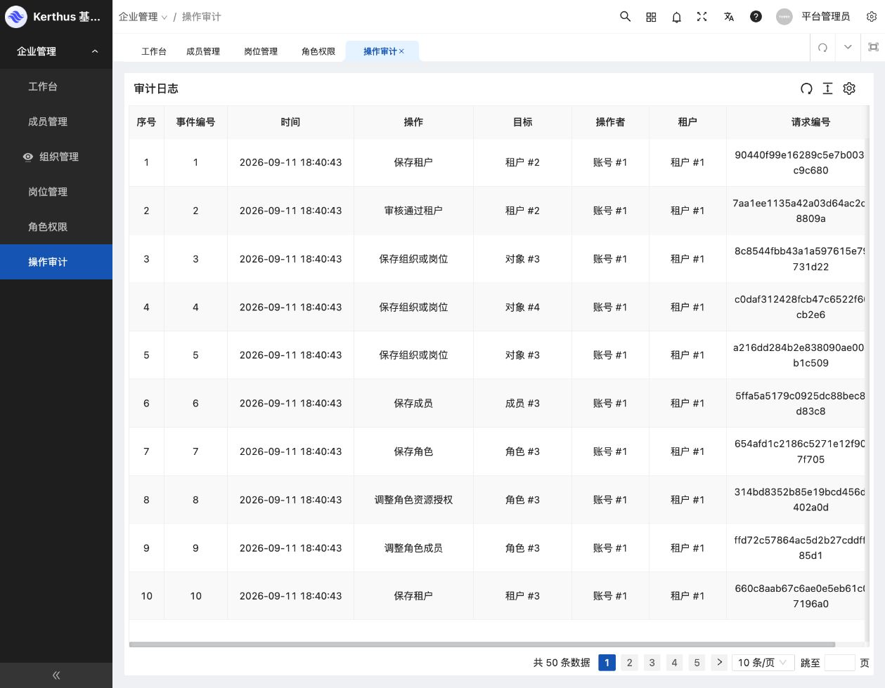
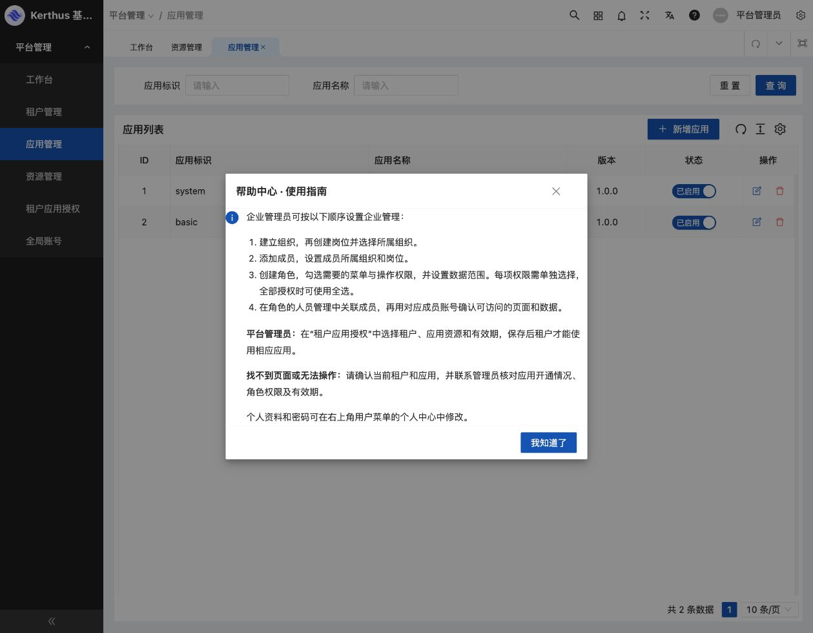

# SaaS 基础底座视觉与交互验收记录

验收日期：2026-09-11。验收对象为当前复用前端和 Go / go-micro 后端的 SaaS 基础功能。

本轮使用 Codex 内置浏览器逐页操作并查看截图，结合前后端回归测试修复发现的问题。已经覆盖全部现有基础模块的主要流程；这不表示所有字段组合、浏览器或生产场景均已穷尽。

## 环境与数据保护

- `http://127.0.0.1:15173`：现有历史数据环境，只读检查历史记录、查询、详情、应用切换和默认应用兼容展示。原始 `beehive_saas` 未重新导入或改写；当前运行库沿用已迁移的数据。
- `http://127.0.0.1:15174`：独立随机 MySQL 数据库、Redis 命名空间和 MinIO 桶，使用合成平台管理员、两个租户管理员及受限成员。增删改、授权、上传、改密、审核均在该环境完成。
- 真实后端已重新构建并启动最新版本。更新前后账号 62、租户 45、成员 62、应用 5；账号认证版本总和保持一致。既有会话仍然有效。
- 收尾已停止隔离验收进程，临时配置目录已移除，15174 及其随机 API/RPC 端口已关闭。清理程序负责撤销测试会话、删除随机数据库及对象桶。真实前端 15173、网关 18080、RPC 19090 仍运行，网关健康检查成功。
- 后续复现可使用 `python3 scripts/visual-acceptance.py`，详见 [隔离验收环境说明](../../scripts/README-visual-acceptance.md)。固定测试密码仅用于合成环境，报告不包含真实凭据。

## 浏览器验收矩阵

“通过”指本行列出的场景已经实际操作并核对结果；带说明的条目应连同限制一起理解。

| 模块 | 实际验收内容 | 结果 |
| --- | --- | --- |
| 登录与会话 | 空表单校验、错误密码、手机登录、刷新恢复、退出取消/确认、修改邮箱后的邮箱登录 | 通过；错误密码未出现重复超时提示堆叠 |
| 工作台与导航 | 欢迎区、应用卡片、快捷入口、搜索导航、菜单和标签切换、面包屑、404 返回首页 | 通过；修复布局及异步面包屑残留 |
| 应用切换 | 历史账号在基础平台与研发运营平台之间切换，核对菜单并恢复基础平台 | 通过 |
| 租户管理 | 查询、分页、日期筛选、创建、编辑、审核开通、停用、待审核租户删除；查看已驳回状态 | 通过；已开通租户删除会明确拒绝，要求先停用并独立清理数据 |
| 租户详情 | 基本信息、组织、岗位、成员、角色页面；永久有效与地域名称显示 | 通过；只读详情不再出现必填错误装饰 |
| 组织管理 | 树选中、编辑和保存、新增后继续编辑、父组织名称、临时组织删除 | 通过 |
| 岗位管理 | 新增、停用、删除及旧数据列表展示 | 通过 |
| 成员管理 | 新增、编辑、停用、重置密码校验与成功路径、租户成员范围、历史默认应用展示 | 通过；旧默认应用不可用时显示说明并保留原值 |
| 全局账号 | 旧账号列表与分页、合成账号编辑，核对手机号保持正确 | 通过 |
| 角色管理 | 新增、编辑、启停、删除、成员绑定/解绑、既有授权无修改保存 | 通过；绑定即时生效，弹窗文案已改为说明这一行为 |
| 最小权限 | 受限成员只看到工作台及组织只读入口，编辑控件不可用，直接访问平台账号路由无数据 | 通过 |
| 租户隔离 | A/B 两租户分别登录；B 仅看到自己的成员，搜索 A 手机号为空；审计不展示 A 的事件 | 通过，并有后端隔离回归 |
| 应用目录 | 创建、编辑、状态切换、详情展示及删除合成应用 | 通过 |
| 应用授权 | 新租户授权、设置一年有效期、保存及取消授权 | 通过；精确资源集合与有效期保留另有回归测试 |
| 资源管理 | 新增根菜单、连续编辑保存、创建/删除子功能、删除根资源、应用搜索、切换应用后清空旧编辑状态 | 通过；组件打开方式是当前支持范围 |
| 接口绑定 | 既有绑定无修改保存、草稿移除再添加同一合法接口、跨应用接口拒绝、无可选接口提示 | 通过；拒绝后数据库未留下部分更新 |
| 个人资料 | 昵称修改、头像选择/裁剪/上传、刷新确认持久化 | 通过；修复保存响应处理和头像兜底 |
| 安全设置 | 当前密码错误、修改密码成功并退出、新密码重新登录；邮箱修改校验及重新登录 | 通过；未实现的绑定/MFA 等演示项已移除 |
| 锁屏 | 自定义锁屏密码场景、使用账号密码解锁 | 通过；修复登录方法无返回值导致解锁误判 |
| 操作审计 | 列表、分页、中文操作名、操作对象、操作者及租户编号 | 通过；历史泛化事件使用“对象 #ID”兼容显示 |
| 页面辅助操作 | 通知各标签空态、本地帮助弹窗、表格密度、列隐藏及重置 | 通过；通知仅验收空态，不代表已接通消息服务 |
| 全屏 | 点击后观察到退出全屏图标，随后浏览器恢复普通状态 | 已观察；内置浏览器未持续保持全屏，不计为完整跨浏览器全屏验收 |
| 窄视口 | 工作台纵向布局、菜单收起、表单宽度、列表容器内横向滚动 | 抽查通过，不等同完整移动端适配验收 |

## 本轮关键修复

1. **授权不再意外扩权。** 角色和租户应用授权树使用精确勾选，禁止父子自动级联；搜索不会丢失隐藏的已选资源，保存时保留资源范围及授权有效期。回归包含“原 3 项授权无修改保存仍为 3 项”。
2. **资源编辑状态可靠。** 修复新增/选中/跨应用切换时旧数据残留、保存后重复新增、接口选择应用不正确、空契约仍可确认、标签切换后表单未隐藏等问题。接口更新仍受后端应用边界及事务约束。
3. **个人资料与认证闭环可用。** 修复资料返回值处理、头像展示、改邮箱后的登录场景识别及账号密码解锁误判；改密成功后重新认证。移除无后端支持的安全设置演示项。
4. **旧数据可继续维护。** 已失效的旧默认应用只允许在原成员、原租户保持原值，不能作为其他成员或租户的新默认应用。前端显示明确说明，避免裸 ID 或空白。
5. **查询与审计准确。** 租户创建日期按 UTC+8 自然日过滤，并在分页计数前执行；审计目标读取 `target_id`，新事件区分组织、岗位及角色启停，失败操作不产生成功审计。
6. **表单和视觉细节收敛。** 修复父组织名称、组织连续保存、编辑弹窗宽度、永久有效/地域展示、错误状态文案、首页排版及面包屑；帮助入口改为本地使用说明。

## 工程检查

| 检查 | 结果 |
| --- | --- |
| `go test ./...` | 通过 |
| `go vet ./...` | 通过 |
| `python3 scripts/check-boundaries.py` | 通过 |
| MySQL 集成回归（含 race） | 通过；覆盖默认应用边界、日期过滤等，整轮约 76.57 秒 |
| 新增审计 MySQL race 回归 | 通过，约 3.90 秒；失败操作、删除后目标保留、租户隔离 |
| `yarn type:check`（`web/admin`） | 最后修改后通过，约 13.72 秒 |
| `node scripts/test-role-grant-tree.cjs` | 通过；精确授权、禁用级联、范围/有效期保留、选择/清空 |
| `yarn build`（`web/admin`） | 最终构建通过，约 62.32 秒 |
| 最新真实后端健康检查 | 成功 |

验收过程中的隔离后端保持原实例，最后的日期、默认应用和审计后端修改由 SQL 回归验证；最新真实后端已更新，日期过滤在真实数据环境重新核对。未声称最后版本的全部写入流程又在浏览器重跑了一遍。

## 明确边界与后续工作

- 未接通的短信登录、SSO、MFA、第三方账号绑定、通知消息服务不计入已实现能力；本轮已移除个人安全页容易误导的演示入口。
- 应用资源目前支持组件路由；外链和 iframe 内嵌不是本轮已完成能力。后续接入其他 SaaS 应用需要补充相应路由与契约验收。
- 未对原项目婚恋等业务模块进行迁移或验收；停用的历史应用继续保留原状态。
- 审核驳回目前仅验证既有状态展示，没有新增审核驳回操作入口。
- 字段资源的独立新建、所有应用属性组合、所有到期状态和所有角色排列未在浏览器逐一穷举。生产负载、渗透测试和多浏览器兼容不属于本轮本地验收结论。
- 平台管理员跨租户操作的审计归属保留操作者的平台上下文；对象列标识被操作对象。后续如需平台全局审计检索，应单独设计查询入口和授权范围。

## 截图证据

### 应用切换弹窗补验

用户反馈确认框贴边后复现：受控确认框使用普通 Modal，继承了普通表单弹窗的正文零内边距，之前的视觉验收遗漏了这一回归。现为受控确认框添加独立样式，恢复 24px 内边距、图标与正文间距及无分隔线的按钮区域。首页卡片和顶部应用入口均已在内置浏览器复验；取消保留当前应用，确认正确切换菜单，并已恢复验收开始时的应用。共享实现的帮助弹窗也已截图检查。

截图仅保存不含真实成员列表的页面；审计和帮助截图来自合成环境。

